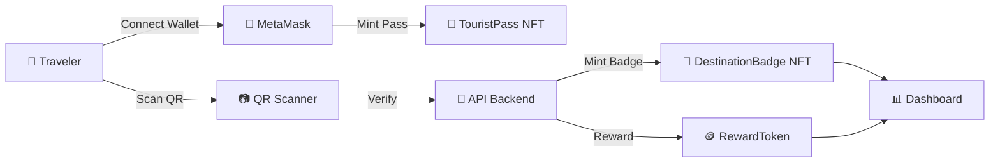

<div align="center">

# 🌍 TravelVerse Pass

## *Blockchain-Based Smart Tourism Platform*

**NFT Tourist Pass sebagai Digital Travel Identity**

<br/>


<br/>

> 🎓 **Tugas Akhir Mata Kuliah Blockchain**
> Dokumen ini mengikuti gaya penulisan teknis **ISO/IEC** untuk konsistensi dan keterbacaan akademik.

</div>

---

## 📑 Document Control

<table>
  <tr>
    <td><b>📄 Document Title</b></td>
    <td>TravelVerse Pass — Project Guide</td>
    <td><b>🏷️ Version</b></td>
    <td><code>1.0.0</code></td>
  </tr>
  <tr>
    <td><b>📅 Date</b></td>
    <td>2026-05-14</td>
    <td><b>📊 Status</b></td>
    <td><code>DRAFT</code></td>
  </tr>
  <tr>
    <td><b>🔖 Classification</b></td>
    <td>Academic / Open Source</td>
    <td><b>🌐 Domain</b></td>
    <td>Smart Tourism · Web3</td>
  </tr>
</table>

---

## 👥 Tim Pengembang

<table>
  <thead>
    <tr>
      <th align="center">No.</th>
      <th align="left">Nama Lengkap</th>
      <th align="center">Role</th>
    </tr>
  </thead>
  <tbody>
    <tr>
      <td align="center"><b>01</b></td>
      <td>👤 <b>Ahsanta Khalqi Imany</b></td>
      <td align="center">Developer</td>
    </tr>
    <tr>
      <td align="center"><b>02</b></td>
      <td>👤 <b>Andika Pratama Putra</b></td>
      <td align="center">Developer</td>
    </tr>
    <tr>
      <td align="center"><b>03</b></td>
      <td>👤 <b>Bagus Setiawan</b></td>
      <td align="center">Developer</td>
    </tr>
    <tr>
      <td align="center"><b>04</b></td>
      <td>👤 <b>Hilmy Raihan Alkindy</b></td>
      <td align="center">Developer</td>
    </tr>
  </tbody>
</table>

---

## 📋 Table of Contents

<table>
<tr>
<td width="50%" valign="top">

**📘 Section A — Pendahuluan**
- [1. Scope & Overview](#1-scope--overview)
- [2. Technology Stack](#2-technology-stack)
- [3. System Architecture](#3-system-architecture)

**📗 Section B — Implementation**
- [4. Development Roadmap](#4-development-roadmap)
- [5. Smart Contracts Specification](#5-smart-contracts-specification)
- [6. Environment Setup](#6-environment-setup)

</td>
<td width="50%" valign="top">

**📙 Section C — Operasional**
- [7. Vibe Coding Prompts](#7-vibe-coding-prompts)
- [8. MVP Scope](#8-mvp-scope)
- [9. Best Practices & Notes](#9-best-practices--notes)

**📕 Annexes**
- [A. References](#annex-a--references)
- [B. Glossary](#annex-b--glossary)

</td>
</tr>
</table>

---

## 1. Scope & Overview

### 1.1 Definisi Proyek

> **TravelVerse Pass** adalah platform *smart tourism* berbasis blockchain yang mentransformasi pengalaman wisata menjadi aset digital yang terverifikasi, *collectible*, dan *gamified*.

### 1.2 Value Proposition

<table>
<tr>
<td align="center" width="33%">

### 🪙
#### **Collectible**
Setiap kunjungan wisata menghasilkan NFT badge yang unik dan permanen.

</td>
<td align="center" width="33%">

### ✅
#### **Verified**
Tiket dan bukti kunjungan tidak dapat dipalsukan berkat ledger blockchain.

</td>
<td align="center" width="33%">

### 🎮
#### **Gamified**
Sistem level, badge, dan reward token meningkatkan engagement wisatawan.

</td>
</tr>
</table>

### 1.3 Permasalahan & Solusi

| 🆔  | ❌ Permasalahan | ✅ Solusi yang Ditawarkan |
|:---:|:---|:---|
| `P-01` | Tiket wisata mudah dipalsukan | **NFT Tourist Pass (ERC-721)** sebagai tiket digital terverifikasi |
| `P-02` | Tidak ada program loyalty lintas destinasi | **Reward Token (ERC-20)** yang berlaku lintas destinasi |
| `P-03` | Pengalaman wisata yang monoton | **Gamifikasi**: level traveler, badge, dan challenge |
| `P-04` | Tidak ada bukti perjalanan digital yang authentic | **Journey Timeline** dari koleksi NFT on-chain |

---

## 2. Technology Stack

### 2.1 Stack Overview

<table>
<tr>
<th align="center" width="20%">🎨 Layer</th>
<th align="center" width="35%">🛠️ Technology</th>
<th align="left" width="45%">📝 Rationale</th>
</tr>
<tr>
<td align="center"><b>Frontend</b></td>
<td align="center">Next.js 14 · Tailwind CSS · shadcn/ui</td>
<td>Full-stack framework dengan App Router & API Routes built-in</td>
</tr>
<tr>
<td align="center"><b>Smart Contract</b></td>
<td align="center">Solidity 0.8.20 · Hardhat · OpenZeppelin</td>
<td>Ekosistem paling matang dengan dokumentasi terbaik</td>
</tr>
<tr>
<td align="center"><b>Wallet Layer</b></td>
<td align="center">ethers.js v6 · MetaMask</td>
<td>Library interaksi blockchain yang ringan dan modern</td>
</tr>
<tr>
<td align="center"><b>Network</b></td>
<td align="center">Polygon Amoy Testnet</td>
<td>Gas fee gratis, fast finality, ideal untuk demo akademik</td>
</tr>
<tr>
<td align="center"><b>Storage</b></td>
<td align="center">Pinata (IPFS)</td>
<td>Decentralized storage dengan free tier yang generous</td>
</tr>
<tr>
<td align="center"><b>Backend</b></td>
<td align="center">Next.js API Routes</td>
<td>Tidak perlu server terpisah, deploy serverless</td>
</tr>
<tr>
<td align="center"><b>Database</b></td>
<td align="center">Supabase (PostgreSQL)</td>
<td>Setup 5 menit, auth built-in, free tier memadai</td>
</tr>
</table>

### 2.2 Justifikasi Pemilihan Stack

| Kriteria | Alasan |
|:---|:---|
| **🚀 Time-to-Market** | Stack monolitik mempercepat development untuk timeline akademik |
| **💰 Cost Efficiency** | Semua tools menggunakan free tier — biaya pengembangan = 0 |
| **🤖 AI Compatibility** | Dokumentasi yang melimpah → AI assistant menghasilkan kode lebih akurat |
| **📚 Community Support** | Komunitas besar di Stack Overflow, GitHub, dan Discord |

---

## 3. System Architecture

### 3.1 Struktur Direktori

```
📦 travelverse/
│
├── 📂 contracts/                    # 🔗 Smart Contracts (Solidity)
│   ├── 📜 TouristPass.sol           # ERC-721: identitas wisata digital
│   ├── 📜 DestinationBadge.sol      # ERC-721: badge NFT per destinasi
│   └── 📜 RewardToken.sol           # ERC-20: token loyalty
│
├── 📂 scripts/                      # ⚙️  Hardhat scripts
│   └── 📄 deploy.js                 # Deploy semua contract sekaligus
│
├── 📂 test/                         # 🧪 Unit test contract
│   └── 📄 TravelVerse.test.js
│
├── 📂 frontend/                     # 🎨 Next.js Application
│   ├── 📂 app/
│   │   ├── 📄 page.tsx              # 🏠 Landing page
│   │   ├── 📂 dashboard/
│   │   │   └── 📄 page.tsx          # 📊 Traveler dashboard
│   │   ├── 📂 destinations/
│   │   │   └── 📄 page.tsx          # 🗺️  List destinasi wisata
│   │   ├── 📂 scan/
│   │   │   └── 📄 page.tsx          # 📷 QR scanner page
│   │   └── 📂 api/
│   │       ├── 📄 qr/route.ts       # Generate & verifikasi QR
│   │       └── 📄 verify/route.ts   # Verifikasi kunjungan
│   │
│   ├── 📂 components/
│   │   ├── 🧩 WalletConnect.tsx     # Connect MetaMask button
│   │   ├── 🧩 NFTBadgeCard.tsx      # NFT badge card display
│   │   ├── 🧩 LevelProgress.tsx     # Traveler level progress bar
│   │   └── 🧩 JourneyTimeline.tsx   # Travel journey timeline
│   │
│   └── 📂 lib/
│       ├── 📄 contracts.ts          # ABI + contract address
│       ├── 📄 supabase.ts           # Supabase client
│       └── 📄 ethers.ts             # Ethers.js helper
│
├── ⚙️  hardhat.config.js            # Konfigurasi Hardhat + Polygon Amoy
├── 🔐 .env                          # API keys (NEVER COMMIT!)
└── 📖 README.md                     # Dokumentasi proyek ini
```

### 3.2 High-Level Flow



---

## 4. Development Roadmap

### 4.1 Phase Breakdown

<table>
<tr>
<th width="15%">🚦 Phase</th>
<th width="25%">📅 Timeline</th>
<th width="60%">🎯 Deliverables</th>
</tr>
<tr>
<td align="center"><b>Phase 1</b><br/>🔗<br/><i>Smart Contracts</i></td>
<td align="center"><b>Hari 1–3</b></td>
<td>

- [ ] `TouristPass.sol` — ERC-721, 1 per wallet
- [ ] `DestinationBadge.sol` — ERC-721, mint via QR scan
- [ ] `RewardToken.sol` — ERC-20 loyalty token
- [ ] Deploy ke Polygon Amoy Testnet
- [ ] Verifikasi di Polygonscan

</td>
</tr>
<tr>
<td align="center"><b>Phase 2</b><br/>🎨<br/><i>Frontend Core</i></td>
<td align="center"><b>Hari 4–7</b></td>
<td>

- [ ] Wallet connect dengan MetaMask
- [ ] Halaman mint Tourist Pass
- [ ] Dashboard badge collection
- [ ] Level + progress bar
- [ ] Halaman list destinasi

</td>
</tr>
<tr>
<td align="center"><b>Phase 3</b><br/>📷<br/><i>QR System</i></td>
<td align="center"><b>Hari 8–9</b></td>
<td>

- [ ] Backend: generate QR (signed + expiry)
- [ ] Frontend: QR scanner (`react-qr-reader`)
- [ ] Verifikasi QR → mint badge NFT
- [ ] Supabase: simpan visit history & tx_hash

</td>
</tr>
<tr>
<td align="center"><b>Phase 4</b><br/>✨<br/><i>Polish & Demo</i></td>
<td align="center"><b>Hari 10–11</b></td>
<td>

- [ ] Journey Timeline (visualisasi perjalanan)
- [ ] Auto level-up pada milestone
- [ ] Loading state + toast notification
- [ ] Responsive mobile
- [ ] Demo video / slide presentasi

</td>
</tr>
</table>

---

## 5. Smart Contracts Specification

### 5.1 Contract Index

| 🆔 | Contract Name | Standard | Purpose |
|:---:|:---|:---:|:---|
| `SC-01` | `TouristPass.sol` | **ERC-721** | Identitas wisata digital (1 per wallet) |
| `SC-02` | `DestinationBadge.sol` | **ERC-721** | Badge NFT collectible per destinasi |
| `SC-03` | `RewardToken.sol` | **ERC-20** | Token loyalty untuk aktivitas wisata |

---

### 5.2 `TouristPass.sol` — ERC-721

> **Fungsi:** Identitas wisata digital, dengan batasan **1 NFT per wallet**.

<details>
<summary>📄 <b>View Source Code</b></summary>

```solidity
// SPDX-License-Identifier: MIT
pragma solidity ^0.8.20;

import "@openzeppelin/contracts/token/ERC721/ERC721.sol";
import "@openzeppelin/contracts/access/Ownable.sol";

contract TouristPass is ERC721, Ownable {
    uint256 private _tokenIds;

    struct PassData {
        string username;
        string level;      // Beginner, Explorer, Adventurer, Legendary
        uint256 visitedCount;
    }

    mapping(uint256 => PassData) public passData;
    mapping(address => uint256) public walletToToken;
    mapping(address => bool) public hasMinted;

    constructor() ERC721("TravelVerse Pass", "TVP") Ownable(msg.sender) {}

    function mintPass(string memory username) public {
        require(!hasMinted[msg.sender], "Already have a pass");
        _tokenIds++;
        _safeMint(msg.sender, _tokenIds);
        passData[_tokenIds] = PassData(username, "Beginner", 0);
        walletToToken[msg.sender] = _tokenIds;
        hasMinted[msg.sender] = true;
    }

    function incrementVisit(address user) public onlyOwner {
        uint256 tokenId = walletToToken[user];
        passData[tokenId].visitedCount++;
        _updateLevel(tokenId);
    }

    function _updateLevel(uint256 tokenId) internal {
        uint256 count = passData[tokenId].visitedCount;
        if (count >= 50)      passData[tokenId].level = "Legendary Traveler";
        else if (count >= 21) passData[tokenId].level = "Adventurer";
        else if (count >= 6)  passData[tokenId].level = "Explorer";
        else                  passData[tokenId].level = "Beginner";
    }
}
```

</details>

---

### 5.3 `DestinationBadge.sol` — ERC-721

> **Fungsi:** Badge NFT collectible yang di-mint setiap kali user check-in di destinasi.

<details>
<summary>📄 <b>View Source Code</b></summary>

```solidity
// SPDX-License-Identifier: MIT
pragma solidity ^0.8.20;

import "@openzeppelin/contracts/token/ERC721/ERC721.sol";
import "@openzeppelin/contracts/access/Ownable.sol";

contract DestinationBadge is ERC721, Ownable {
    uint256 private _tokenIds;

    mapping(address => mapping(uint256 => uint256)) public lastClaim;
    mapping(address => mapping(uint256 => bool)) public hasClaimed;

    event BadgeMinted(address indexed user, uint256 destinationId, uint256 tokenId);

    constructor() ERC721("TravelVerse Badge", "TVB") Ownable(msg.sender) {}

    function mintBadge(address user, uint256 destinationId) public onlyOwner {
        uint256 today = block.timestamp / 1 days;
        require(lastClaim[user][destinationId] < today, "Already claimed today");

        _tokenIds++;
        _safeMint(user, _tokenIds);
        lastClaim[user][destinationId] = today;
        hasClaimed[user][destinationId] = true;

        emit BadgeMinted(user, destinationId, _tokenIds);
    }
}
```

</details>

---

### 5.4 `RewardToken.sol` — ERC-20

> **Fungsi:** Token loyalty (`TVT`) yang diberikan saat user melakukan check-in.

<details>
<summary>📄 <b>View Source Code</b></summary>

```solidity
// SPDX-License-Identifier: MIT
pragma solidity ^0.8.20;

import "@openzeppelin/contracts/token/ERC20/ERC20.sol";
import "@openzeppelin/contracts/access/Ownable.sol";

contract RewardToken is ERC20, Ownable {
    uint256 public constant CHECKIN_REWARD = 10 * 10**18; // 10 TVT per check-in

    constructor() ERC20("TravelVerse Token", "TVT") Ownable(msg.sender) {
        _mint(address(this), 1_000_000 * 10**18); // 1 juta token supply awal
    }

    function rewardUser(address user) public onlyOwner {
        _transfer(address(this), user, CHECKIN_REWARD);
    }
}
```

</details>

---

### 5.5 Sistem Level Traveler

<table>
<tr>
<th align="center">🏆 Tier</th>
<th align="center">📛 Level</th>
<th align="center">📍 Visited Count</th>
<th align="center">🎁 Privilege</th>
</tr>
<tr>
<td align="center">🥉</td>
<td align="center"><b>Beginner</b></td>
<td align="center"><code>0 – 5</code></td>
<td align="center">Basic badge</td>
</tr>
<tr>
<td align="center">🥈</td>
<td align="center"><b>Explorer</b></td>
<td align="center"><code>6 – 20</code></td>
<td align="center">Silver badge + bonus token</td>
</tr>
<tr>
<td align="center">🥇</td>
<td align="center"><b>Adventurer</b></td>
<td align="center"><code>21 – 50</code></td>
<td align="center">Gold badge + special access</td>
</tr>
<tr>
<td align="center">👑</td>
<td align="center"><b>Legendary Traveler</b></td>
<td align="center"><code>50+</code></td>
<td align="center">Exclusive perks + VIP status</td>
</tr>
</table>

---

## 6. Environment Setup

### 6.1 Prerequisites

| Tool | Min. Version | Verifikasi |
|:---|:---:|:---|
| 🟢 Node.js | `≥ 18.x` | `node --version` |
| 📦 npm | `≥ 9.x` | `npm --version` |
| 🦊 MetaMask | Latest | Browser extension installed |
| 💼 Git | `≥ 2.x` | `git --version` |

### 6.2 Setup Hardhat

```bash
mkdir travelverse && cd travelverse
npm init -y
npm install --save-dev hardhat @nomicfoundation/hardhat-toolbox
npx hardhat init
# ✅ Pilih: Create a JavaScript project

npm install @openzeppelin/contracts
```

### 6.3 Setup Next.js Frontend

```bash
npx create-next-app@latest frontend
# ✅ TypeScript    | ✅ Tailwind CSS
# ✅ App Router   | ✅ ESLint

cd frontend
npm install ethers @supabase/supabase-js
npm install react-qr-reader qrcode
npm install @shadcn/ui
```

### 6.4 Konfigurasi `hardhat.config.js`

```javascript
require("@nomicfoundation/hardhat-toolbox");
require("dotenv").config();

module.exports = {
  solidity: "0.8.20",
  networks: {
    amoy: {
      url: "https://rpc-amoy.polygon.technology/",
      accounts: [process.env.PRIVATE_KEY],
      chainId: 80002,
    },
  },
};
```

### 6.5 Environment Variables (`.env`)

> ⚠️ **PERINGATAN:** Jangan pernah commit file `.env` ke repository publik!

```env
# 🔐 Wallet & Blockchain
PRIVATE_KEY=your_metamask_private_key_here

# 🗄️  Supabase
NEXT_PUBLIC_SUPABASE_URL=your_supabase_url
NEXT_PUBLIC_SUPABASE_ANON_KEY=your_supabase_anon_key

# 📜 Deployed Contract Addresses
NEXT_PUBLIC_TOURIST_PASS_ADDRESS=deployed_contract_address
NEXT_PUBLIC_BADGE_ADDRESS=deployed_contract_address
NEXT_PUBLIC_TOKEN_ADDRESS=deployed_contract_address

# 🔒 QR Security
QR_SECRET=your_random_secret_for_qr_signing
```

### 6.6 Deploy Contracts

```bash
npx hardhat run scripts/deploy.js --network amoy
```

### 6.7 Acquiring Test MATIC

| Step | Action |
|:---:|:---|
| **1️⃣** | Buka [Polygon Faucet](https://faucet.polygon.technology/) |
| **2️⃣** | Pilih **Amoy Testnet** |
| **3️⃣** | Paste wallet address |
| **4️⃣** | Klaim **MATIC** gratis untuk gas fee |

---

## 7. Vibe Coding Prompts

> 💡 Template prompt siap pakai untuk AI assistant (Claude / ChatGPT / Cursor).

<details>
<summary>📝 <b>7.1 — Smart Contract Generation</b></summary>

```
Buatkan Solidity smart contract ERC-721 bernama TouristPass menggunakan 
OpenZeppelin. Contract ini mint 1 NFT per wallet saat user register. 
NFT menyimpan metadata: username, level (default 'Beginner'), dan 
visited_count (default 0). Tambahkan fungsi untuk increment visited_count 
yang hanya bisa dipanggil oleh owner contract. Tambahkan juga auto-update 
level berdasarkan visited_count: 0-5 = Beginner, 6-20 = Explorer, 
21-50 = Adventurer, 50+ = Legendary Traveler.
```

</details>

<details>
<summary>📝 <b>7.2 — Wallet Connect Component</b></summary>

```
Buatkan React component di Next.js TypeScript untuk connect MetaMask wallet.
Tampilkan tombol 'Connect Wallet', setelah connect tampilkan address yang 
disingkat (0x1234...abcd) dan tombol 'Disconnect'. Gunakan ethers.js v6 
dan Tailwind CSS. Handle kasus: MetaMask tidak terinstall, user reject, 
dan network salah (harus Polygon Amoy chainId 80002).
```

</details>

<details>
<summary>📝 <b>7.3 — QR Generation API</b></summary>

```
Buatkan Next.js API Route (App Router) untuk generate QR code destinasi wisata.
QR berisi: destination_id, timestamp, dan HMAC signature menggunakan secret key.
QR expired setelah 15 menit. Gunakan library 'qrcode' untuk generate QR image.
Return QR sebagai base64 image string.
```

</details>

<details>
<summary>📝 <b>7.4 — QR Verifikasi & Mint Badge</b></summary>

```
Buatkan Next.js API Route untuk verifikasi QR scan dan trigger mint NFT badge.
Flow: terima QR data → validasi signature → cek expiry → cek user belum 
claim hari ini di Supabase → panggil smart contract mintBadge() menggunakan 
ethers.js → simpan record ke Supabase (user_wallet, destination_id, timestamp, 
tx_hash) → return sukses/gagal dengan pesan yang jelas.
```

</details>

<details>
<summary>📝 <b>7.5 — Dashboard Traveler</b></summary>

```
Buatkan halaman dashboard Next.js TypeScript untuk traveler TravelVerse Pass.
Tampilkan: nama user, level saat ini, progress bar menuju level berikutnya,
jumlah destinasi dikunjungi, saldo reward token, dan grid NFT badge yang 
dimiliki (gambar + nama destinasi). Ambil data dari smart contract menggunakan 
ethers.js v6. Gunakan Tailwind CSS dengan tema warna hijau dan biru.
```

</details>

<details>
<summary>📝 <b>7.6 — Journey Timeline</b></summary>

```
Buatkan React component Journey Timeline untuk menampilkan riwayat perjalanan 
wisata user. Data diambil dari Supabase (destination_name, visit_date, tx_hash).
Tampilkan sebagai timeline vertikal dengan tahun sebagai header, mirip travel 
passport. Setiap item tampilkan: icon destinasi, nama tempat, tanggal, dan 
link ke Polygonscan untuk lihat transaksi NFT-nya.
```

</details>

---

## 8. MVP Scope

### 8.1 Priority Matrix

<table>
<tr>
<th width="33%" align="center">✅ MUST HAVE</th>
<th width="33%" align="center">🎯 NICE TO HAVE</th>
<th width="33%" align="center">❌ OUT OF SCOPE</th>
</tr>
<tr valign="top">
<td>

*Wajib untuk kelulusan*

- [ ] Wallet login MetaMask
- [ ] Mint Tourist Pass NFT (1x/wallet)
- [ ] List destinasi wisata
- [ ] Generate QR per destinasi
- [ ] Scan QR → mint Badge NFT
- [ ] Earn Reward Token saat check-in
- [ ] Dashboard badge & level
- [ ] Deploy ke Polygon Amoy

</td>
<td>

*Nilai tambahan*

- [ ] Journey Timeline visual
- [ ] Analytics (total visit, populer)
- [ ] Notifikasi level up
- [ ] Responsive mobile design
- [ ] Dark mode toggle
- [ ] Multi-language support

</td>
<td>

*Skip untuk MVP*

- ❌ Marketplace NFT
- ❌ AR integration
- ❌ DAO governance
- ❌ Cross-chain bridge
- ❌ Anti-GPS spoofing lanjutan
- ❌ Mobile native app

</td>
</tr>
</table>

### 8.2 Acceptance Criteria

| 🆔 | Requirement | Severity |
|:---:|:---|:---:|
| `REQ-01` | User dapat connect MetaMask wallet | 🔴 Critical |
| `REQ-02` | User dapat mint Tourist Pass (1x per wallet) | 🔴 Critical |
| `REQ-03` | User dapat scan QR dan menerima Badge NFT | 🔴 Critical |
| `REQ-04` | User dapat melihat koleksi NFT di dashboard | 🔴 Critical |
| `REQ-05` | Level otomatis update sesuai visited count | 🟡 High |
| `REQ-06` | Reward token bertambah setiap check-in | 🟡 High |
| `REQ-07` | Journey timeline menampilkan riwayat visual | 🟢 Medium |

---

## 9. Best Practices & Notes

### 9.1 Critical Reminders

<table>
<tr>
<td width="50%" valign="top">

#### ⚠️ Security Warnings

1. **Jangan commit `.env`** — tambahkan ke `.gitignore` dari awal
2. **Jangan pakai mainnet** — gunakan testnet Amoy untuk demo
3. **Backup private key** wallet di tempat aman
4. **Simpan deployed address** — dibutuhkan di frontend

</td>
<td width="50%" valign="top">

#### 🔒 QR Security Standards

1. QR harus **dinamis** dengan **expiry 15 menit**
2. Gunakan **HMAC signature** untuk anti-tampering
3. Validasi selalu di **server-side**
4. Log setiap percobaan validasi di Supabase

</td>
</tr>
</table>

### 9.2 Academic Discussion Points

| 🎓 Topik | 💭 Sudut Pandang |
|:---|:---|
| **NFT Utility** | Pembanding NFT spekulatif vs utility-driven |
| **Blockchain Adoption** | Implementasi di sektor pariwisata Indonesia |
| **Tokenomics** | Supply, emission rate, dan use case TVT |
| **QR Verification** | Keamanan sistem QR berbasis blockchain |
| **Decentralized Identity** | DID vs identitas tradisional |
| **Gamification Economy** | Retensi wisatawan via game mechanics |

### 9.3 Recommended Workflow

> 💡 **Workflow Vibe Coding:**

```
📋 PRD → 🧩 Breakdown Fitur → 🤖 AI Prompt per Komponen
     ↓
🔍 Review & Iterasi → 🔗 Integrasi → 🎬 Demo
```

---

## Annex A — References

| 🔗 Resource | 🌐 URL |
|:---|:---|
| 🛡️ OpenZeppelin Contracts | https://docs.openzeppelin.com/contracts |
| ⚒️  Hardhat Documentation | https://hardhat.org/docs |
| 💧 Polygon Amoy Faucet | https://faucet.polygon.technology |
| 📌 Pinata (IPFS) | https://www.pinata.cloud |
| 🗄️  Supabase Documentation | https://supabase.com/docs |
| 📚 ethers.js v6 Docs | https://docs.ethers.org/v6 |
| 🔍 Polygonscan (Amoy) | https://amoy.polygonscan.com |

---

## Annex B — Glossary

| 🔤 Term | 📖 Definition |
|:---|:---|
| **DApp** | *Decentralized Application* — aplikasi berbasis smart contract |
| **ERC-20** | Standard token fungible di Ethereum (digunakan untuk RewardToken) |
| **ERC-721** | Standard NFT non-fungible di Ethereum (digunakan untuk Pass & Badge) |
| **Gas Fee** | Biaya transaksi pada blockchain Ethereum/Polygon |
| **HMAC** | *Hash-based Message Authentication Code* — signature anti-tampering |
| **IPFS** | *InterPlanetary File System* — protokol penyimpanan terdesentralisasi |
| **Mint** | Proses pembuatan token / NFT baru di blockchain |
| **Testnet** | Jaringan blockchain untuk testing (tidak menggunakan uang sungguhan) |
| **Wallet** | Aplikasi penyimpan kunci privat untuk interaksi blockchain |

---

<div align="center">

### 📜 *Document End*

**Dibuat dengan ❤️ untuk Tugas Akhir Mata Kuliah Blockchain**

<sub>© 2026 TravelVerse Pass Team — Released under MIT License</sub>

</div>
