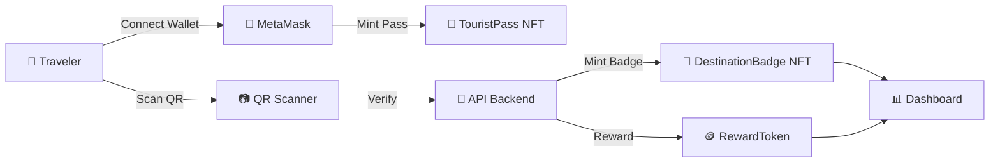

<div align="center">

# 🌍 TravelVerse Pass

## *Blockchain-Based Smart Tourism Platform*

**NFT Tourist Pass sebagai Digital Travel Identity**

<br/>


<br/>

> 🎓 **Tugas Akhir Mata Kuliah Blockchain**
> Dokumen ini mengikuti gaya penulisan teknis **ISO/IEC** untuk konsistensi dan keterbacaan akademik.

</div>

---

## 📑 Document Control

<table>
  <tr>
    <td><b>📄 Document Title</b></td>
    <td>TravelVerse Pass — Project Guide</td>
    <td><b>🏷️ Version</b></td>
    <td><code>1.0.0</code></td>
  </tr>
  <tr>
    <td><b>📅 Date</b></td>
    <td>2026-05-18</td>
    <td><b>📊 Status</b></td>
    <td><code>WORKING — Hardhat Local</code></td>
  </tr>
  <tr>
    <td><b>🔖 Classification</b></td>
    <td>Academic / Open Source</td>
    <td><b>🌐 Domain</b></td>
    <td>Smart Tourism · Web3</td>
  </tr>
</table>

---

## 👥 Tim Pengembang

<table>
  <thead>
    <tr>
      <th align="center">No.</th>
      <th align="left">Nama Lengkap</th>
      <th align="center">Role</th>
    </tr>
  </thead>
  <tbody>
    <tr>
      <td align="center"><b>01</b></td>
      <td>👤 <b>Ahsanta Khalqi Imany</b></td>
      <td align="center">Developer</td>
    </tr>
    <tr>
      <td align="center"><b>02</b></td>
      <td>👤 <b>Andika Pratama Putra</b></td>
      <td align="center">Developer</td>
    </tr>
    <tr>
      <td align="center"><b>03</b></td>
      <td>👤 <b>Bagus Setiawan</b></td>
      <td align="center">Developer</td>
    </tr>
    <tr>
      <td align="center"><b>04</b></td>
      <td>👤 <b>Hilmy Raihan Alkindy</b></td>
      <td align="center">Developer</td>
    </tr>
  </tbody>
</table>

---

## 📚 Documentation Hub

> 🎯 **Pemula? Mulai dari sini:** [GETTING_STARTED.md](docs/GETTING_STARTED.md) — setup lengkap dari nol sampai jalan.

<table>
<tr>
<th align="left">📄 Dokumen</th>
<th align="left">Untuk Siapa</th>
<th align="left">Isi</th>
</tr>
<tr>
<td><a href="docs/GETTING_STARTED.md"><b>🚀 GETTING_STARTED</b></a></td>
<td>Pemula / Tester</td>
<td>Setup 4-terminal, install, deploy, MetaMask config, demo flow, troubleshooting</td>
</tr>
<tr>
<td><a href="docs/USER_FLOW.md"><b>🛣️ USER_FLOW</b></a></td>
<td>Dosen / Demo viewer</td>
<td>10 flow end-to-end: login, mint, check-in, level up. Includes mermaid sequence diagrams.</td>
</tr>
<tr>
<td><a href="docs/SMART_CONTRACTS.md"><b>📜 SMART_CONTRACTS</b></a></td>
<td>SC Developer</td>
<td>Spec 3 contract (ERC-721 × 2, ERC-20), functions, events, deploy guide</td>
</tr>
<tr>
<td><a href="docs/BACKEND.md"><b>🌐 BACKEND</b></a></td>
<td>Backend Developer / FE integrator</td>
<td>11 endpoint REST API, auth flow SIWE, error codes, integration snippets</td>
</tr>
<tr>
<td><a href="docs/FRONTEND.md"><b>🎨 FRONTEND</b></a></td>
<td>FE Styling Team</td>
<td>Next.js structure, 9 pages, hooks, contexts, styling priority</td>
</tr>
<tr>
<td><a href="docs/SIMULATION_FLOW.md"><b>🧪 SIMULATION_FLOW</b></a></td>
<td>Tester / API Reviewer</td>
<td>Postman collection, cURL examples, bash test script untuk auto-test</td>
</tr>
</table>

---

## 📋 Table of Contents (README ini)

<table>
<tr>
<td width="50%" valign="top">

**📘 Section A — Pendahuluan**
- [1. Scope & Overview](#1-scope--overview)
- [2. Technology Stack](#2-technology-stack)
- [3. System Architecture](#3-system-architecture)

**📗 Section B — Implementation**
- [4. Development Roadmap](#4-development-roadmap)
- [5. Smart Contracts Specification](#5-smart-contracts-specification)
- [6. Environment Setup](#6-environment-setup)

</td>
<td width="50%" valign="top">

**📙 Section C — Operasional**
- [7. Vibe Coding Prompts](#7-vibe-coding-prompts)
- [8. MVP Scope](#8-mvp-scope)
- [9. Best Practices & Notes](#9-best-practices--notes)

**📕 Annexes**
- [A. References](#annex-a--references)
- [B. Glossary](#annex-b--glossary)

</td>
</tr>
</table>

---

## 🚀 Quick Start (60 detik)

```bash
# 1. Clone & install (3 folder)
git clone https://github.com/ChrozaGaming/TravelVersePass-Blockchain.git
cd TravelVersePass-Blockchain
npm install && cd backend && npm install && cd ../frontend && npm install && cd ..

# 2. Compile contracts
npm run compile

# 3. Start 4 terminal (urut):
# T1: npx hardhat node                              (port 8545)
# T2: npm run deploy:local                          (deploy 3 contract)
# T3: cd backend && npm run dev                     (port 4000)
# T4: cd frontend && npm run dev                    (port 3000)

# 4. Setup MetaMask:
# - Add network Hardhat Localhost (chainId 31337, RPC http://localhost:8545)
# - Import account #1 (PK: 0x59c6995e998f97a5a0044966f0945389dc9e86dae88c7a8412f4603b6b78690d)

# 5. Buka http://localhost:3000 → Login → Mint Pass → Scan QR → Enjoy
```

**⚠️ Detail lengkap + env setup + Supabase setup ada di [GETTING_STARTED.md](docs/GETTING_STARTED.md).**

---

## 1. Scope & Overview

### 1.1 Definisi Proyek

> **TravelVerse Pass** adalah platform *smart tourism* berbasis blockchain yang mentransformasi pengalaman wisata menjadi aset digital yang terverifikasi, *collectible*, dan *gamified*.

### 1.2 Value Proposition

<table>
<tr>
<td align="center" width="33%">

### 🪙
#### **Collectible**
Setiap kunjungan wisata menghasilkan NFT badge yang unik dan permanen.

</td>
<td align="center" width="33%">

### ✅
#### **Verified**
Tiket dan bukti kunjungan tidak dapat dipalsukan berkat ledger blockchain.

</td>
<td align="center" width="33%">

### 🎮
#### **Gamified**
Sistem level, badge, dan reward token meningkatkan engagement wisatawan.

</td>
</tr>
</table>

### 1.3 Permasalahan & Solusi

| 🆔  | ❌ Permasalahan | ✅ Solusi yang Ditawarkan |
|:---:|:---|:---|
| `P-01` | Tiket wisata mudah dipalsukan | **NFT Tourist Pass (ERC-721)** sebagai tiket digital terverifikasi |
| `P-02` | Tidak ada program loyalty lintas destinasi | **Reward Token (ERC-20)** yang berlaku lintas destinasi |
| `P-03` | Pengalaman wisata yang monoton | **Gamifikasi**: level traveler, badge, dan challenge |
| `P-04` | Tidak ada bukti perjalanan digital yang authentic | **Journey Timeline** dari koleksi NFT on-chain |

---

## 2. Technology Stack

### 2.1 Stack Overview

<table>
<tr>
<th align="center" width="20%">🎨 Layer</th>
<th align="center" width="35%">🛠️ Technology</th>
<th align="left" width="45%">📝 Rationale</th>
</tr>
<tr>
<td align="center"><b>Frontend</b></td>
<td align="center">Next.js 14 · TypeScript · Tailwind CSS</td>
<td>App Router, SSR/CSR hybrid, Tailwind utility-first styling</td>
</tr>
<tr>
<td align="center"><b>Backend API</b></td>
<td align="center">Node.js 18+ · Express 4.21 · ethers.js v6</td>
<td>REST API, orchestrate on-chain calls, SIWE auth + JWT</td>
</tr>
<tr>
<td align="center"><b>Smart Contract</b></td>
<td align="center">Solidity 0.8.28 · Hardhat · OpenZeppelin v5</td>
<td>EVM cancun support, ecosystem paling matang</td>
</tr>
<tr>
<td align="center"><b>Wallet Layer</b></td>
<td align="center">ethers.js v6 · MetaMask</td>
<td>Library interaksi blockchain modern dengan NonceManager</td>
</tr>
<tr>
<td align="center"><b>Network (Default)</b></td>
<td align="center">🟢 <b>Hardhat Localhost</b> (chainId 31337)</td>
<td>Zero gas, instant tx, 20 akun pre-funded 10000 ETH — ideal untuk demo</td>
</tr>
<tr>
<td align="center"><b>Network (Optional)</b></td>
<td align="center">Polygon Amoy Testnet (chainId 80002)</td>
<td>Public testnet — butuh MATIC dari faucet</td>
</tr>
<tr>
<td align="center"><b>Database</b></td>
<td align="center">Supabase (PostgreSQL)</td>
<td>Setup 5 menit, free tier untuk master data destinasi + visit history</td>
</tr>
<tr>
<td align="center"><b>QR Auth</b></td>
<td align="center">HMAC-SHA256 + JWT (HS256)</td>
<td>Anti-tampering QR token (TTL 15 min) + session JWT (7 hari) |
</tr>
</table>

### 2.2 Justifikasi Pemilihan Stack

| Kriteria | Alasan |
|:---|:---|
| **🚀 Time-to-Market** | Stack monolitik mempercepat development untuk timeline akademik |
| **💰 Cost Efficiency** | Semua tools menggunakan free tier — biaya pengembangan = 0 |
| **🤖 AI Compatibility** | Dokumentasi yang melimpah → AI assistant menghasilkan kode lebih akurat |
| **📚 Community Support** | Komunitas besar di Stack Overflow, GitHub, dan Discord |

---

## 3. System Architecture

### 3.1 Struktur Direktori

```
📦 travelversepass-blockchain/
│
├── 📂 contracts/                       # 🔗 Smart Contracts (Solidity 0.8.28)
│   ├── 📜 TouristPass.sol              # ERC-721: identitas wisata digital
│   ├── 📜 DestinationBadge.sol         # ERC-721: badge NFT per destinasi
│   └── 📜 RewardToken.sol              # ERC-20: token loyalty TVT
│
├── 📂 scripts/                         # ⚙️  Hardhat scripts
│   └── 📄 deploy.js                    # Deploy 3 contract + save deployments.json
│
├── 📂 test/                            # 🧪 Unit test contract (Chai + Hardhat)
│   ├── 📄 TouristPass.test.js          # 18 test cases
│   ├── 📄 DestinationBadge.test.js     # 13 test cases
│   └── 📄 RewardToken.test.js          # 13 test cases
│
├── 📂 backend/                         # 🌐 Express + Node.js REST API
│   ├── 📂 src/
│   │   ├── 📄 server.js                # Express entry, CORS + rate limit
│   │   ├── 📄 config.js                # Env validation (chainId flexible)
│   │   ├── 📂 routes/                  # auth · destinations · qr · checkin · me
│   │   ├── 📂 services/                # blockchain · qr · jwt · nonce · supabase
│   │   ├── 📂 middleware/              # JWT auth · centralized error handler
│   │   └── 📂 lib/                     # ABI loader · Zod validators
│   ├── 📂 db/                          # 🗄️  Supabase SQL
│   │   ├── 📄 schema.sql               # destinations + visits tables + RLS
│   │   ├── 📄 seed.sql                 # 8 destinasi Indonesia
│   │   └── 📄 update_images.sql        # Update image URLs
│   ├── 📂 tests/                       # Unit tests (node --test)
│   ├── 📄 package.json
│   └── 📄 .env.example
│
├── 📂 frontend/                        # 🎨 Next.js 14 (App Router + TypeScript)
│   ├── 📂 app/
│   │   ├── 📄 layout.tsx               # AuthProvider + UserMenu header
│   │   ├── 📄 page.tsx                 # 🏠 Landing
│   │   ├── 📂 login/                   # 🦊 Wallet sign-in (SIWE)
│   │   ├── 📂 mint-pass/               # 🪪 Mint Tourist Pass (direct contract)
│   │   ├── 📂 dashboard/               # 📊 Profile + level + balance
│   │   ├── 📂 destinations/            # 🗺️  List + detail + QR display
│   │   ├── 📂 scan/                    # 📷 QR scanner + check-in result
│   │   ├── 📂 badges/                  # 🏅 NFT collection
│   │   └── 📂 timeline/                # 📅 Journey timeline grouped by year
│   ├── 📂 components/                  # WalletConnect · UserMenu · QRScanner · dll
│   ├── 📂 contexts/AuthContext.tsx     # Global wallet + JWT state
│   ├── 📂 lib/                         # api · auth · wallet · contracts · types
│   └── 📄 .env.local                   # NEXT_PUBLIC_* config
│
├── 📂 docs/                            # 📚 Dokumentasi lengkap
│   ├── 📖 GETTING_STARTED.md           # 🚀 Setup pemula (15 sections)
│   ├── 📖 USER_FLOW.md                 # 🛣️  End-to-end user journey
│   ├── 📖 SMART_CONTRACTS.md           # 📜 SC spec + handover
│   ├── 📖 BACKEND.md                   # 🌐 REST API reference
│   ├── 📖 FRONTEND.md                  # 🎨 Next.js structure
│   └── 📖 SIMULATION_FLOW.md           # 🧪 Postman/cURL guide
│
├── 📂 deployments/                     # ⛓️  Auto-saved address (per network)
│   └── 📄 localhost.json               # Address Hardhat local (deterministic)
│
├── ⚙️  hardhat.config.js               # Solidity 0.8.28 cancun, Amoy + localhost
├── 🔐 .env                             # PRIVATE_KEY, contract addresses (gitignored)
├── 📄 package.json                     # Root: hardhat + deps
└── 📖 README.md                        # File ini (documentation hub)
```

### 3.2 High-Level Flow



---

## 4. Development Roadmap

### 4.1 Phase Breakdown

<table>
<tr>
<th width="15%">🚦 Phase</th>
<th width="25%">📅 Timeline</th>
<th width="60%">🎯 Deliverables</th>
</tr>
<tr>
<td align="center"><b>Phase 1</b><br/>🔗<br/><i>Smart Contracts</i></td>
<td align="center"><b>Hari 1–3</b></td>
<td>

- [ ] `TouristPass.sol` — ERC-721, 1 per wallet
- [ ] `DestinationBadge.sol` — ERC-721, mint via QR scan
- [ ] `RewardToken.sol` — ERC-20 loyalty token
- [ ] Deploy ke Polygon Amoy Testnet
- [ ] Verifikasi di Polygonscan

</td>
</tr>
<tr>
<td align="center"><b>Phase 2</b><br/>🎨<br/><i>Frontend Core</i></td>
<td align="center"><b>Hari 4–7</b></td>
<td>

- [ ] Wallet connect dengan MetaMask
- [ ] Halaman mint Tourist Pass
- [ ] Dashboard badge collection
- [ ] Level + progress bar
- [ ] Halaman list destinasi

</td>
</tr>
<tr>
<td align="center"><b>Phase 3</b><br/>📷<br/><i>QR System</i></td>
<td align="center"><b>Hari 8–9</b></td>
<td>

- [ ] Backend: generate QR (signed + expiry)
- [ ] Frontend: QR scanner (`react-qr-reader`)
- [ ] Verifikasi QR → mint badge NFT
- [ ] Supabase: simpan visit history & tx_hash

</td>
</tr>
<tr>
<td align="center"><b>Phase 4</b><br/>✨<br/><i>Polish & Demo</i></td>
<td align="center"><b>Hari 10–11</b></td>
<td>

- [ ] Journey Timeline (visualisasi perjalanan)
- [ ] Auto level-up pada milestone
- [ ] Loading state + toast notification
- [ ] Responsive mobile
- [ ] Demo video / slide presentasi

</td>
</tr>
</table>

---

## 5. Smart Contracts Specification

### 5.1 Contract Index

| 🆔 | Contract Name | Standard | Purpose |
|:---:|:---|:---:|:---|
| `SC-01` | `TouristPass.sol` | **ERC-721** | Identitas wisata digital (1 per wallet) |
| `SC-02` | `DestinationBadge.sol` | **ERC-721** | Badge NFT collectible per destinasi |
| `SC-03` | `RewardToken.sol` | **ERC-20** | Token loyalty untuk aktivitas wisata |

---

### 5.2 `TouristPass.sol` — ERC-721

> **Fungsi:** Identitas wisata digital, dengan batasan **1 NFT per wallet**.

<details>
<summary>📄 <b>View Source Code</b></summary>

```solidity
// SPDX-License-Identifier: MIT
pragma solidity ^0.8.20;

import "@openzeppelin/contracts/token/ERC721/ERC721.sol";
import "@openzeppelin/contracts/access/Ownable.sol";

contract TouristPass is ERC721, Ownable {
    uint256 private _tokenIds;

    struct PassData {
        string username;
        string level;      // Beginner, Explorer, Adventurer, Legendary
        uint256 visitedCount;
    }

    mapping(uint256 => PassData) public passData;
    mapping(address => uint256) public walletToToken;
    mapping(address => bool) public hasMinted;

    constructor() ERC721("TravelVerse Pass", "TVP") Ownable(msg.sender) {}

    function mintPass(string memory username) public {
        require(!hasMinted[msg.sender], "Already have a pass");
        _tokenIds++;
        _safeMint(msg.sender, _tokenIds);
        passData[_tokenIds] = PassData(username, "Beginner", 0);
        walletToToken[msg.sender] = _tokenIds;
        hasMinted[msg.sender] = true;
    }

    function incrementVisit(address user) public onlyOwner {
        uint256 tokenId = walletToToken[user];
        passData[tokenId].visitedCount++;
        _updateLevel(tokenId);
    }

    function _updateLevel(uint256 tokenId) internal {
        uint256 count = passData[tokenId].visitedCount;
        if (count >= 50)      passData[tokenId].level = "Legendary Traveler";
        else if (count >= 21) passData[tokenId].level = "Adventurer";
        else if (count >= 6)  passData[tokenId].level = "Explorer";
        else                  passData[tokenId].level = "Beginner";
    }
}
```

</details>

---

### 5.3 `DestinationBadge.sol` — ERC-721

> **Fungsi:** Badge NFT collectible yang di-mint setiap kali user check-in di destinasi.

<details>
<summary>📄 <b>View Source Code</b></summary>

```solidity
// SPDX-License-Identifier: MIT
pragma solidity ^0.8.20;

import "@openzeppelin/contracts/token/ERC721/ERC721.sol";
import "@openzeppelin/contracts/access/Ownable.sol";

contract DestinationBadge is ERC721, Ownable {
    uint256 private _tokenIds;

    mapping(address => mapping(uint256 => uint256)) public lastClaim;
    mapping(address => mapping(uint256 => bool)) public hasClaimed;

    event BadgeMinted(address indexed user, uint256 destinationId, uint256 tokenId);

    constructor() ERC721("TravelVerse Badge", "TVB") Ownable(msg.sender) {}

    function mintBadge(address user, uint256 destinationId) public onlyOwner {
        uint256 today = block.timestamp / 1 days;
        require(lastClaim[user][destinationId] < today, "Already claimed today");

        _tokenIds++;
        _safeMint(user, _tokenIds);
        lastClaim[user][destinationId] = today;
        hasClaimed[user][destinationId] = true;

        emit BadgeMinted(user, destinationId, _tokenIds);
    }
}
```

</details>

---

### 5.4 `RewardToken.sol` — ERC-20

> **Fungsi:** Token loyalty (`TVT`) yang diberikan saat user melakukan check-in.

<details>
<summary>📄 <b>View Source Code</b></summary>

```solidity
// SPDX-License-Identifier: MIT
pragma solidity ^0.8.20;

import "@openzeppelin/contracts/token/ERC20/ERC20.sol";
import "@openzeppelin/contracts/access/Ownable.sol";

contract RewardToken is ERC20, Ownable {
    uint256 public constant CHECKIN_REWARD = 10 * 10**18; // 10 TVT per check-in

    constructor() ERC20("TravelVerse Token", "TVT") Ownable(msg.sender) {
        _mint(address(this), 1_000_000 * 10**18); // 1 juta token supply awal
    }

    function rewardUser(address user) public onlyOwner {
        _transfer(address(this), user, CHECKIN_REWARD);
    }
}
```

</details>

---

### 5.5 Sistem Level Traveler

<table>
<tr>
<th align="center">🏆 Tier</th>
<th align="center">📛 Level</th>
<th align="center">📍 Visited Count</th>
<th align="center">🎁 Privilege</th>
</tr>
<tr>
<td align="center">🥉</td>
<td align="center"><b>Beginner</b></td>
<td align="center"><code>0 – 5</code></td>
<td align="center">Basic badge</td>
</tr>
<tr>
<td align="center">🥈</td>
<td align="center"><b>Explorer</b></td>
<td align="center"><code>6 – 20</code></td>
<td align="center">Silver badge + bonus token</td>
</tr>
<tr>
<td align="center">🥇</td>
<td align="center"><b>Adventurer</b></td>
<td align="center"><code>21 – 50</code></td>
<td align="center">Gold badge + special access</td>
</tr>
<tr>
<td align="center">👑</td>
<td align="center"><b>Legendary Traveler</b></td>
<td align="center"><code>50+</code></td>
<td align="center">Exclusive perks + VIP status</td>
</tr>
</table>

---

## 6. Environment Setup

> 📘 **Detail lengkap step-by-step ada di [docs/GETTING_STARTED.md](docs/GETTING_STARTED.md).**
> Section ini hanya rangkuman cepat. Default mode: **Hardhat Local** (zero gas, instant tx).

### 6.1 Prerequisites

| Tool | Min. Version | Verifikasi |
|:---|:---:|:---|
| 🟢 Node.js | `≥ 18.x` | `node --version` |
| 📦 npm | `≥ 9.x` | `npm --version` |
| 🦊 MetaMask | Latest | Browser extension installed |
| 💼 Git | `≥ 2.x` | `git --version` |
| 🗄️ Supabase | Free tier | https://supabase.com (signup) |

### 6.2 Install Dependencies (3 folder)

```bash
# Root (smart contracts + Hardhat)
npm install

# Backend (Express API)
cd backend && npm install && cd ..

# Frontend (Next.js)
cd frontend && npm install && cd ..
```

### 6.3 Compile & Deploy ke Hardhat Localhost

```bash
# Terminal 1: Start local blockchain (port 8545)
npx hardhat node

# Terminal 2: Compile + deploy (address deterministic, selalu sama)
npm run compile
npm run deploy:local
```

Output:
```
TouristPass:       0x5FbDB2315678afecb367f032d93F642f64180aa3
DestinationBadge:  0xe7f1725E7734CE288F8367e1Bb143E90bb3F0512
RewardToken:       0x9fE46736679d2D9a65F0992F2272dE9f3c7fa6e0
```

Address ini **selalu sama** di Hardhat Local (deterministic dari Account #0 nonce). Auto-saved di `deployments/localhost.json`.

### 6.4 Environment Variables (3 file)

> ⚠️ **PERINGATAN:** Jangan pernah commit file `.env*` ke repository publik!

**Root `.env`** — untuk Hardhat deploy:
```env
PRIVATE_KEY=ac0974bec39a17e36ba4a6b4d238ff944bacb478cbed5efcae784d7bf4f2ff80
# Address dari deployments/localhost.json
TOURIST_PASS_ADDRESS=0x5FbDB2315678afecb367f032d93F642f64180aa3
BADGE_ADDRESS=0xe7f1725E7734CE288F8367e1Bb143E90bb3F0512
TOKEN_ADDRESS=0x9fE46736679d2D9a65F0992F2272dE9f3c7fa6e0
```

**`backend/.env`** — untuk API:
```env
PORT=4000
RPC_URL=http://127.0.0.1:8545
CHAIN_ID=31337
OWNER_PRIVATE_KEY=0xac0974bec39a17e36ba4a6b4d238ff944bacb478cbed5efcae784d7bf4f2ff80
TOURIST_PASS_ADDRESS=0x5FbDB2315678afecb367f032d93F642f64180aa3
BADGE_ADDRESS=0xe7f1725E7734CE288F8367e1Bb143E90bb3F0512
TOKEN_ADDRESS=0x9fE46736679d2D9a65F0992F2272dE9f3c7fa6e0
JWT_SECRET=<openssl rand -hex 32>
QR_SECRET=<openssl rand -hex 32>
SUPABASE_URL=https://xxxxx.supabase.co
SUPABASE_SERVICE_ROLE_KEY=<secret_key_supabase>
```

**`frontend/.env.local`** — untuk Next.js:
```env
NEXT_PUBLIC_API_URL=http://localhost:4000
NEXT_PUBLIC_TOURIST_PASS_ADDRESS=0x5FbDB2315678afecb367f032d93F642f64180aa3
NEXT_PUBLIC_CHAIN_ID=31337
NEXT_PUBLIC_CHAIN_NAME=Hardhat Localhost
NEXT_PUBLIC_CHAIN_RPC=http://127.0.0.1:8545
NEXT_PUBLIC_BLOCK_EXPLORER=
```

### 6.5 Setup Supabase Database

Buat project Supabase → SQL Editor → jalankan:
1. [backend/db/schema.sql](backend/db/schema.sql) (tables + RLS)
2. [backend/db/seed.sql](backend/db/seed.sql) (8 destinasi)

Detail di [docs/GETTING_STARTED.md Section 8](docs/GETTING_STARTED.md).

### 6.6 Setup MetaMask (Sekali)

**Add Network manually:**

| Field | Value |
|:---|:---|
| Network name | Hardhat Localhost |
| RPC URL | `http://localhost:8545` |
| Chain ID | `31337` |
| Currency | ETH |

**Import Test Account #1** (10000 ETH pre-funded):
```
Private Key: 0x59c6995e998f97a5a0044966f0945389dc9e86dae88c7a8412f4603b6b78690d
Address: 0x70997970C51812dc3A010C7d01b50e0d17dc79C8
```

⚠️ Account #0 (`0xf39Fd6e51aad88F6F4ce6aB8827279cffFb92266`) dipakai backend sebagai owner — **jangan di-import ke MetaMask**.

### 6.7 Pindah ke Polygon Amoy Testnet (Optional)

Kalau mau pindah dari Hardhat Local ke testnet asli (Polygon Amoy):

1. Update `backend/.env` & `frontend/.env.local`:
   - `RPC_URL=https://rpc-amoy.polygon.technology/`
   - `CHAIN_ID=80002`
   - `NEXT_PUBLIC_BLOCK_EXPLORER=https://amoy.polygonscan.com`
2. Claim MATIC dari [Polygon Faucet](https://faucet.polygon.technology/)
3. Deploy: `npm run deploy:amoy` (butuh ~2 MATIC untuk 3 contract)
4. Update address di semua file `.env`

Detail di [docs/GETTING_STARTED.md FAQ Q2](docs/GETTING_STARTED.md#15-faq).

---

## 7. Vibe Coding Prompts

> 💡 Template prompt siap pakai untuk AI assistant favorit (ChatGPT / Cursor / Copilot).

<details>
<summary>📝 <b>7.1 — Smart Contract Generation</b></summary>

```
Buatkan Solidity smart contract ERC-721 bernama TouristPass menggunakan 
OpenZeppelin. Contract ini mint 1 NFT per wallet saat user register. 
NFT menyimpan metadata: username, level (default 'Beginner'), dan 
visited_count (default 0). Tambahkan fungsi untuk increment visited_count 
yang hanya bisa dipanggil oleh owner contract. Tambahkan juga auto-update 
level berdasarkan visited_count: 0-5 = Beginner, 6-20 = Explorer, 
21-50 = Adventurer, 50+ = Legendary Traveler.
```

</details>

<details>
<summary>📝 <b>7.2 — Wallet Connect Component</b></summary>

```
Buatkan React component di Next.js TypeScript untuk connect MetaMask wallet.
Tampilkan tombol 'Connect Wallet', setelah connect tampilkan address yang 
disingkat (0x1234...abcd) dan tombol 'Disconnect'. Gunakan ethers.js v6 
dan Tailwind CSS. Handle kasus: MetaMask tidak terinstall, user reject, 
dan network salah (harus Polygon Amoy chainId 80002).
```

</details>

<details>
<summary>📝 <b>7.3 — QR Generation API</b></summary>

```
Buatkan Next.js API Route (App Router) untuk generate QR code destinasi wisata.
QR berisi: destination_id, timestamp, dan HMAC signature menggunakan secret key.
QR expired setelah 15 menit. Gunakan library 'qrcode' untuk generate QR image.
Return QR sebagai base64 image string.
```

</details>

<details>
<summary>📝 <b>7.4 — QR Verifikasi & Mint Badge</b></summary>

```
Buatkan Next.js API Route untuk verifikasi QR scan dan trigger mint NFT badge.
Flow: terima QR data → validasi signature → cek expiry → cek user belum 
claim hari ini di Supabase → panggil smart contract mintBadge() menggunakan 
ethers.js → simpan record ke Supabase (user_wallet, destination_id, timestamp, 
tx_hash) → return sukses/gagal dengan pesan yang jelas.
```

</details>

<details>
<summary>📝 <b>7.5 — Dashboard Traveler</b></summary>

```
Buatkan halaman dashboard Next.js TypeScript untuk traveler TravelVerse Pass.
Tampilkan: nama user, level saat ini, progress bar menuju level berikutnya,
jumlah destinasi dikunjungi, saldo reward token, dan grid NFT badge yang 
dimiliki (gambar + nama destinasi). Ambil data dari smart contract menggunakan 
ethers.js v6. Gunakan Tailwind CSS dengan tema warna hijau dan biru.
```

</details>

<details>
<summary>📝 <b>7.6 — Journey Timeline</b></summary>

```
Buatkan React component Journey Timeline untuk menampilkan riwayat perjalanan 
wisata user. Data diambil dari Supabase (destination_name, visit_date, tx_hash).
Tampilkan sebagai timeline vertikal dengan tahun sebagai header, mirip travel 
passport. Setiap item tampilkan: icon destinasi, nama tempat, tanggal, dan 
link ke Polygonscan untuk lihat transaksi NFT-nya.
```

</details>

---

## 8. MVP Scope

### 8.1 Priority Matrix

<table>
<tr>
<th width="33%" align="center">✅ MUST HAVE</th>
<th width="33%" align="center">🎯 NICE TO HAVE</th>
<th width="33%" align="center">❌ OUT OF SCOPE</th>
</tr>
<tr valign="top">
<td>

*Wajib untuk kelulusan*

- [ ] Wallet login MetaMask
- [ ] Mint Tourist Pass NFT (1x/wallet)
- [ ] List destinasi wisata
- [ ] Generate QR per destinasi
- [ ] Scan QR → mint Badge NFT
- [ ] Earn Reward Token saat check-in
- [ ] Dashboard badge & level
- [ ] Deploy ke Polygon Amoy

</td>
<td>

*Nilai tambahan*

- [ ] Journey Timeline visual
- [ ] Analytics (total visit, populer)
- [ ] Notifikasi level up
- [ ] Responsive mobile design
- [ ] Dark mode toggle
- [ ] Multi-language support

</td>
<td>

*Skip untuk MVP*

- ❌ Marketplace NFT
- ❌ AR integration
- ❌ DAO governance
- ❌ Cross-chain bridge
- ❌ Anti-GPS spoofing lanjutan
- ❌ Mobile native app

</td>
</tr>
</table>

### 8.2 Acceptance Criteria

| 🆔 | Requirement | Severity |
|:---:|:---|:---:|
| `REQ-01` | User dapat connect MetaMask wallet | 🔴 Critical |
| `REQ-02` | User dapat mint Tourist Pass (1x per wallet) | 🔴 Critical |
| `REQ-03` | User dapat scan QR dan menerima Badge NFT | 🔴 Critical |
| `REQ-04` | User dapat melihat koleksi NFT di dashboard | 🔴 Critical |
| `REQ-05` | Level otomatis update sesuai visited count | 🟡 High |
| `REQ-06` | Reward token bertambah setiap check-in | 🟡 High |
| `REQ-07` | Journey timeline menampilkan riwayat visual | 🟢 Medium |

---

## 9. Best Practices & Notes

### 9.1 Critical Reminders

<table>
<tr>
<td width="50%" valign="top">

#### ⚠️ Security Warnings

1. **Jangan commit `.env`** — sudah di `.gitignore`, verify sebelum push
2. **Jangan pakai mainnet** — Hardhat Local atau testnet Amoy aja
3. **Hardhat default private key publik** — well-known, **JANGAN pakai untuk wallet mainnet sungguhan**
4. **Backup private key** wallet asli di tempat aman
5. **Jangan share JWT_SECRET/QR_SECRET** — generate ulang `openssl rand -hex 32` kalau bocor

</td>
<td width="50%" valign="top">

#### 🔒 QR Security Standards

1. QR harus **dinamis** dengan **expiry 15 menit**
2. Gunakan **HMAC signature** untuk anti-tampering
3. Validasi selalu di **server-side**
4. Log setiap percobaan validasi di Supabase

</td>
</tr>
</table>

### 9.2 Academic Discussion Points

| 🎓 Topik | 💭 Sudut Pandang |
|:---|:---|
| **NFT Utility** | Pembanding NFT spekulatif vs utility-driven |
| **Blockchain Adoption** | Implementasi di sektor pariwisata Indonesia |
| **Tokenomics** | Supply, emission rate, dan use case TVT |
| **QR Verification** | Keamanan sistem QR berbasis blockchain |
| **Decentralized Identity** | DID vs identitas tradisional |
| **Gamification Economy** | Retensi wisatawan via game mechanics |

### 9.3 Recommended Workflow

> 💡 **Workflow Vibe Coding:**

```
📋 PRD → 🧩 Breakdown Fitur → 🤖 AI Prompt per Komponen
     ↓
🔍 Review & Iterasi → 🔗 Integrasi → 🎬 Demo
```

---

## Annex A — References

| 🔗 Resource | 🌐 URL |
|:---|:---|
| 🛡️ OpenZeppelin Contracts | https://docs.openzeppelin.com/contracts/5.x |
| ⚒️ Hardhat Documentation | https://hardhat.org/docs |
| 🛠️ Hardhat Network (local) | https://hardhat.org/hardhat-network/docs/overview |
| 📚 ethers.js v6 Docs | https://docs.ethers.org/v6 |
| 🗄️ Supabase Documentation | https://supabase.com/docs |
| 🦊 MetaMask Docs | https://docs.metamask.io |
| 🌐 Next.js 14 (App Router) | https://nextjs.org/docs |
| 🔐 Express.js Docs | https://expressjs.com/en/4x/api.html |
| 💧 Polygon Amoy Faucet (optional) | https://faucet.polygon.technology |
| 🔍 Polygonscan Amoy (optional) | https://amoy.polygonscan.com |

---

## Annex B — Glossary

| 🔤 Term | 📖 Definition |
|:---|:---|
| **DApp** | *Decentralized Application* — aplikasi berbasis smart contract |
| **ERC-20** | Standard token fungible di Ethereum (digunakan untuk RewardToken) |
| **ERC-721** | Standard NFT non-fungible di Ethereum (digunakan untuk Pass & Badge) |
| **Gas Fee** | Biaya transaksi pada blockchain Ethereum/Polygon |
| **HMAC** | *Hash-based Message Authentication Code* — signature anti-tampering |
| **IPFS** | *InterPlanetary File System* — protokol penyimpanan terdesentralisasi |
| **Mint** | Proses pembuatan token / NFT baru di blockchain |
| **Testnet** | Jaringan blockchain untuk testing (tidak menggunakan uang sungguhan) |
| **Wallet** | Aplikasi penyimpan kunci privat untuk interaksi blockchain |

---

<div align="center">

### 📜 *Document End*

**Dibuat dengan ❤️ untuk Tugas Akhir Mata Kuliah Blockchain**

<sub>© 2026 TravelVerse Pass Team — Released under MIT License</sub>

</div>
