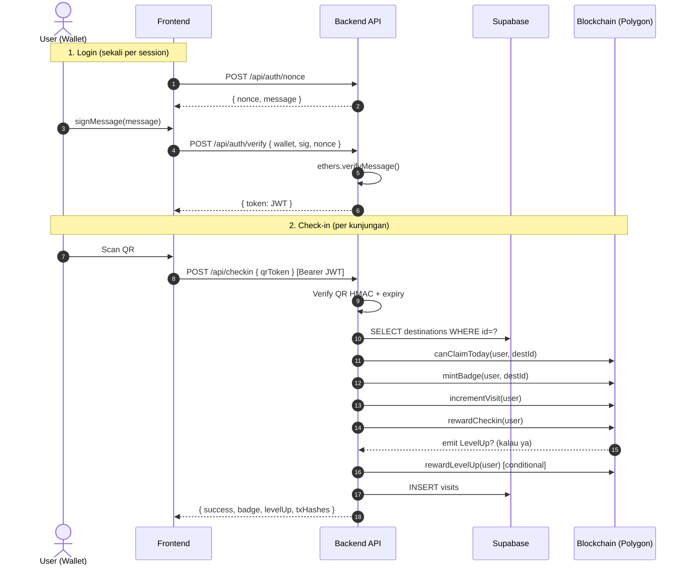
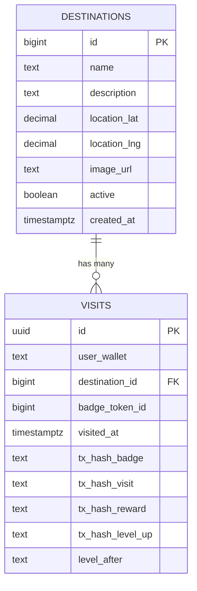

<div align="center">

# 🌐 Backend API — Module Specification

## *TravelVerse Pass · REST API Documentation*

**Node.js · Express · ethers.js v6 · Supabase · JWT (Wallet-Signature Auth)**


> 📘 **Module:** Backend API · **Owner:** Hilmy Raihan Alkindy
> 🤝 **Handover:** Untuk tim Frontend yang akan integrasi.

</div>

---

## 📑 Document Control

<table>
<tr>
<td><b>📄 Document</b></td>
<td>Backend API Module Specification</td>
<td><b>🏷️ Version</b></td>
<td><code>1.0.0</code></td>
</tr>
<tr>
<td><b>📅 Date</b></td>
<td>2026-05-17</td>
<td><b>📊 Status</b></td>
<td><code>READY FOR HANDOVER</code></td>
</tr>
<tr>
<td><b>👤 Module Owner</b></td>
<td>Hilmy Raihan Alkindy</td>
<td><b>🔗 Base URL</b></td>
<td><code>http://localhost:4000</code></td>
</tr>
</table>

---

## 📋 Table of Contents

<table>
<tr>
<td width="50%" valign="top">

**📘 Section A — Overview**
- [1. Module Scope](#1-module-scope)
- [2. Architecture](#2-architecture)
- [3. Auth Flow (Wallet Signature)](#3-auth-flow-wallet-signature)

**📗 Section B — API Reference**
- [4. Endpoints Catalog](#4-endpoints-catalog)
- [5. Endpoint Details](#5-endpoint-details)
- [6. Error Codes](#6-error-codes)

</td>
<td width="50%" valign="top">

**📙 Section C — Integration & Ops**
- [7. Frontend Integration Examples](#7-frontend-integration-examples)
- [8. Setup & Run](#8-setup--run)
- [9. Database Schema](#9-database-schema)
- [10. Testing](#10-testing)

**📕 Annexes**
- [A. Env Variables](#annex-a--env-variables)
- [B. Glossary](#annex-b--glossary)

</td>
</tr>
</table>

---

## 1. Module Scope

### 1.1 Tanggung Jawab

Backend module ini menjadi **single source of truth** untuk:
- Auth user via wallet signature → JWT
- Master data destinasi wisata (Supabase)
- Generate & verify QR check-in (HMAC, 15 menit TTL)
- Orchestrate transaksi on-chain (mintBadge → incrementVisit → rewardCheckin)
- Record visit history untuk timeline FE
- Read-only blockchain queries (pass, badges, balance)

### 1.2 Boundary

<table>
<tr>
<th width="50%" align="center">✅ DI DALAM SCOPE</th>
<th width="50%" align="center">❌ DI LUAR SCOPE</th>
</tr>
<tr valign="top">
<td>

- REST API endpoints
- Wallet signature verification (SIWE-style)
- QR token generation + HMAC
- Smart contract orchestration via ethers.js
- Supabase queries (destinations, visits)
- Error mapping (revert → HTTP)

</td>
<td>

- Smart contracts (sudah di [SMART_CONTRACTS.md](SMART_CONTRACTS.md))
- Frontend UI (tim FE)
- MetaMask connection (tim FE)
- IPFS metadata upload (untuk MVP gak perlu)
- Payment / fiat onramp (out of MVP)

</td>
</tr>
</table>

---

## 2. Architecture

### 2.1 Folder Structure

```
backend/
├── src/
│   ├── server.js              # Express entry + middleware
│   ├── config.js              # Env vars (Zod-validated)
│   ├── routes/
│   │   ├── index.js           # Mount semua sub-router
│   │   ├── auth.js            # POST /auth/nonce, /auth/verify
│   │   ├── destinations.js    # GET /destinations
│   │   ├── qr.js              # GET /destinations/:id/qr
│   │   ├── checkin.js         # POST /checkin
│   │   └── me.js              # GET /me, /me/badges, /me/timeline
│   ├── services/
│   │   ├── blockchain.js      # ethers.js + 3 contracts
│   │   ├── qr.js              # HMAC QR token + image
│   │   ├── jwt.js             # Sign & verify JWT
│   │   ├── nonce.js           # In-memory nonce store
│   │   └── supabase.js        # DB client
│   ├── middleware/
│   │   ├── auth.js            # JWT validation
│   │   └── errorHandler.js    # Centralized error → JSON
│   └── lib/
│       ├── abi.js             # Load ABI dari ../artifacts
│       └── validators.js      # Zod schemas
├── db/
│   ├── schema.sql             # Supabase tables
│   └── seed.sql               # Sample 8 destinasi Indonesia
├── tests/
│   ├── _setup.js              # Env stubs untuk tests
│   ├── qr.test.js
│   ├── jwt.test.js
│   └── nonce.test.js
├── package.json
└── .env.example
```

### 2.2 Request Flow (Check-in)



---

## 3. Auth Flow (Wallet Signature)

Pola **SIWE-style** (Sign-In with Ethereum) yang disederhanakan.

### 3.1 Mekanisme

1. **Request nonce** — FE minta server generate random nonce untuk wallet user
2. **Sign message** — User sign pesan `Welcome to TravelVerse... Nonce: <nonce>` di MetaMask
3. **Verify** — FE kirim signature ke server, server recover address & match dengan wallet
4. **JWT issued** — Server terbitkan JWT yang berisi `wallet` (lowercase). TTL 7 hari.

### 3.2 Properties

| Property | Value |
|:---|:---|
| **Nonce TTL** | 5 menit |
| **Nonce store** | In-memory (Map). Production: pindah ke Redis. |
| **Nonce reuse** | Single-use, dihapus setelah verify sukses |
| **JWT algorithm** | HS256 |
| **JWT TTL** | 7 hari (configurable via `JWT_EXPIRES_IN`) |
| **JWT payload** | `{ wallet: "0x...", iat, exp }` |

### 3.3 Security Notes

- Nonce dibinding ke wallet → user A tidak bisa pakai nonce user B
- Message format **server-controlled** → FE tidak bisa convince server untuk verify pesan lain
- JWT secret HARUS random ≥32 bytes: `openssl rand -hex 32`

---

## 4. Endpoints Catalog

| 🔹 | Method | Path | Auth | Description |
|:---:|:---:|:---|:---:|:---|
| `E-01` | `GET` | `/health` | ❌ | Health check |
| `E-02` | `POST` | `/api/auth/nonce` | ❌ | Request nonce untuk sign |
| `E-03` | `POST` | `/api/auth/verify` | ❌ | Verify signature → JWT |
| `E-04` | `GET` | `/api/auth/me` | 🔒 | Verifikasi JWT masih valid |
| `E-05` | `GET` | `/api/destinations` | ❌ | List destinasi aktif |
| `E-06` | `GET` | `/api/destinations/:id` | ❌ | Detail satu destinasi |
| `E-07` | `GET` | `/api/destinations/:id/qr` | ❌ | Generate QR rotating (15 min) |
| `E-08` | `POST` | `/api/checkin` | 🔒 | Verify QR + orchestrate on-chain |
| `E-09` | `GET` | `/api/me` | 🔒 | Profile (pass + balance) |
| `E-10` | `GET` | `/api/me/badges` | 🔒 | NFT badge collection |
| `E-11` | `GET` | `/api/me/timeline` | 🔒 | Journey timeline per tahun |

**Legend:** 🔒 Butuh `Authorization: Bearer <jwt>` · ❌ Public

---

## 5. Endpoint Details

### `E-02` POST `/api/auth/nonce`

Request nonce untuk wallet user. Step pertama dari login flow.

**Request**
```http
POST /api/auth/nonce
Content-Type: application/json

{ "wallet": "0xAbCdEf0123456789AbCdEf0123456789AbCdEf01" }
```

**Response 200**
```json
{
  "nonce": "a1b2c3d4e5f6...",
  "message": "Welcome to TravelVerse Pass!\n\nSign this message to login...",
  "expiresAt": 1716483200000
}
```

**Errors:** `400 validation_error` (invalid wallet)

---

### `E-03` POST `/api/auth/verify`

Verify signature, terbitkan JWT.

**Request**
```http
POST /api/auth/verify
Content-Type: application/json

{
  "wallet": "0xAbCdEf...",
  "signature": "0x...",
  "nonce": "a1b2c3..."
}
```

**Response 200**
```json
{
  "token": "eyJhbGciOiJIUzI1NiIs...",
  "wallet": "0xabcdef...",
  "expiresIn": "7d"
}
```

**Errors:**
- `401 invalid_nonce` — Nonce tidak dikenal / expired / wallet mismatch
- `401 invalid_signature` — Signature tidak match wallet

---

### `E-05` GET `/api/destinations`

List semua destinasi aktif. Public — FE bisa call tanpa login.

**Response 200**
```json
{
  "destinations": [
    {
      "id": 1,
      "name": "Candi Borobudur",
      "description": "Candi Buddha terbesar...",
      "location_lat": "-7.60790000",
      "location_lng": "110.20380000",
      "image_url": "https://...",
      "created_at": "2026-05-17T..."
    }
  ]
}
```

---

### `E-07` GET `/api/destinations/:id/qr`

Generate QR token + base64 PNG. Token rotating tiap call (TTL 15 menit).

**Use case:** Halaman QR display di tablet/papan di lokasi wisata. Polling endpoint ini setiap 10–14 menit.

**Response 200**
```json
{
  "destination": { "id": 1, "name": "Candi Borobudur", "image_url": "..." },
  "token": "1.1716482000.1716482900.abc123def456...",
  "dataUrl": "data:image/png;base64,iVBORw0KGgo...",
  "issuedAt": 1716482000,
  "expiresAt": 1716482900,
  "ttlSeconds": 900
}
```

---

### `E-08` POST `/api/checkin`

The big one. Orchestrate full on-chain check-in flow.

**Request**
```http
POST /api/checkin
Authorization: Bearer <jwt>
Content-Type: application/json

{ "qrToken": "1.1716482000.1716482900.abc123..." }
```

**Response 200 (no level up)**
```json
{
  "success": true,
  "destination": { "id": 1, "name": "Candi Borobudur" },
  "badge": { "tokenId": 42, "destinationId": 1 },
  "reward": { "checkin": "10.0", "levelUpBonus": null },
  "levelUp": null,
  "txHashes": {
    "badge": "0xabc...",
    "visit": "0xdef...",
    "reward": "0x123...",
    "levelUpBonus": null
  }
}
```

**Response 200 (with level up)**
```json
{
  "success": true,
  "badge": { "tokenId": 43, "destinationId": 2 },
  "reward": { "checkin": "10.0", "levelUpBonus": "200.0" },
  "levelUp": { "oldLevel": "Beginner", "newLevel": "Explorer" },
  "txHashes": { "badge": "0x...", "visit": "0x...", "reward": "0x...", "levelUpBonus": "0x..." }
}
```

**Errors:**
- `400 invalid_qr` — QR malformed / signature invalid / expired
- `404 destination_not_found` — Destination not in DB
- `400 NO_PASS` — User belum mint Tourist Pass
- `429 ALREADY_CLAIMED` — Sudah claim hari ini

---

### `E-09` GET `/api/me`

Profile lengkap: pass data (on-chain) + token balance.

**Response 200**
```json
{
  "wallet": "0xabcdef...",
  "pass": {
    "username": "Hilmy",
    "level": "Explorer",
    "visitedCount": 12,
    "mintedAt": "2026-05-01T10:30:00.000Z"
  },
  "balance": "230.0"
}
```

**Response 200 (user belum mint pass)**
```json
{ "wallet": "0xabcdef...", "pass": null, "balance": "0.0" }
```

---

### `E-10` GET `/api/me/badges`

NFT badge collection, di-enrich dengan info destinasi.

**Response 200**
```json
{
  "badges": [
    {
      "tokenId": 42,
      "destination": {
        "id": 1,
        "name": "Candi Borobudur",
        "image_url": "https://...",
        "location_lat": "-7.60790000",
        "location_lng": "110.20380000"
      },
      "mintedAt": "2026-05-17T12:00:00.000Z"
    }
  ]
}
```

---

### `E-11` GET `/api/me/timeline`

Visits di-group per tahun.

**Response 200**
```json
{
  "timeline": {
    "2026": [
      {
        "id": "uuid",
        "destination": { "id": 1, "name": "Borobudur", "image_url": "..." },
        "visitedAt": "2026-05-17T...",
        "badgeTokenId": 42,
        "txHash": "0x...",
        "levelAfter": "Explorer"
      }
    ],
    "2025": [...]
  }
}
```

---

## 6. Error Codes

Semua error response punya format konsisten:
```json
{
  "error": "MACHINE_READABLE_CODE",
  "message": "Pesan user-friendly Bahasa Indonesia",
  "details": { ... } // optional, untuk validation errors
}
```

<table>
<tr>
<th>HTTP</th><th>Error Code</th><th>Meaning</th><th>FE Action</th>
</tr>
<tr><td>400</td><td><code>validation_error</code></td><td>Input gak valid</td><td>Show inline form error</td></tr>
<tr><td>400</td><td><code>invalid_qr</code></td><td>QR malformed/expired</td><td>Suruh user scan ulang</td></tr>
<tr><td>400</td><td><code>NO_PASS</code></td><td>User belum mint Tourist Pass</td><td>Redirect ke /mint-pass</td></tr>
<tr><td>401</td><td><code>unauthorized</code></td><td>Missing/invalid JWT</td><td>Redirect ke login</td></tr>
<tr><td>401</td><td><code>invalid_nonce</code></td><td>Nonce expired/used</td><td>Re-request nonce</td></tr>
<tr><td>401</td><td><code>invalid_signature</code></td><td>Signature gak match</td><td>Re-sign dengan wallet yg benar</td></tr>
<tr><td>404</td><td><code>not_found</code></td><td>Resource gak ada</td><td>Show 404</td></tr>
<tr><td>404</td><td><code>destination_not_found</code></td><td>Destination ID invalid</td><td>Refresh destination list</td></tr>
<tr><td>409</td><td><code>ALREADY_MINTED</code></td><td>User udah punya pass</td><td>Show existing pass</td></tr>
<tr><td>429</td><td><code>ALREADY_CLAIMED</code></td><td>Udah claim hari ini</td><td>Show "datang lagi besok"</td></tr>
<tr><td>500</td><td><code>internal_error</code></td><td>Server crash</td><td>Show generic error toast</td></tr>
<tr><td>503</td><td><code>REWARD_POOL_EMPTY</code></td><td>Pool reward habis</td><td>Show admin notification</td></tr>
</table>

---

## 7. Frontend Integration Examples

> 🎨 Copy-paste-ready untuk tim FE. Pakai `fetch` native, gak butuh axios.

### 7.1 Auth Flow Lengkap

```typescript
// frontend/lib/auth.ts
const API = process.env.NEXT_PUBLIC_API_URL!; // e.g. http://localhost:4000

export async function loginWithWallet(provider: ethers.BrowserProvider) {
  const signer = await provider.getSigner();
  const wallet = await signer.getAddress();

  // 1. Request nonce
  const nonceRes = await fetch(`${API}/api/auth/nonce`, {
    method: "POST",
    headers: { "Content-Type": "application/json" },
    body: JSON.stringify({ wallet }),
  });
  const { nonce, message } = await nonceRes.json();

  // 2. User sign message
  const signature = await signer.signMessage(message);

  // 3. Verify, get JWT
  const verifyRes = await fetch(`${API}/api/auth/verify`, {
    method: "POST",
    headers: { "Content-Type": "application/json" },
    body: JSON.stringify({ wallet, signature, nonce }),
  });
  const { token } = await verifyRes.json();

  // 4. Simpan token (localStorage atau secure cookie)
  localStorage.setItem("tvp_token", token);
  return token;
}

export function getAuthHeader(): Record<string, string> {
  const token = localStorage.getItem("tvp_token");
  return token ? { Authorization: `Bearer ${token}` } : {};
}
```

### 7.2 Fetch User Profile

```typescript
export async function getMyProfile() {
  const res = await fetch(`${API}/api/me`, {
    headers: { ...getAuthHeader() },
  });
  if (res.status === 401) {
    localStorage.removeItem("tvp_token");
    throw new Error("Session expired");
  }
  return res.json();
}
```

### 7.3 Scan QR & Check-in

```typescript
export async function checkin(qrToken: string) {
  const res = await fetch(`${API}/api/checkin`, {
    method: "POST",
    headers: {
      ...getAuthHeader(),
      "Content-Type": "application/json",
    },
    body: JSON.stringify({ qrToken }),
  });

  const data = await res.json();
  if (!res.ok) {
    throw new Error(data.message || "Check-in failed");
  }
  return data;
  // → { success, badge, reward, levelUp, txHashes }
}
```

### 7.4 Display QR di Halaman Destinasi (tablet)

```typescript
// frontend/app/destinations/[id]/qr/page.tsx
"use client";
import { useEffect, useState } from "react";

export default function QRDisplay({ params }: { params: { id: string } }) {
  const [qr, setQr] = useState<any>(null);

  useEffect(() => {
    async function fetchQR() {
      const res = await fetch(`${API}/api/destinations/${params.id}/qr`);
      setQr(await res.json());
    }
    fetchQR();
    // Re-fetch tiap 10 menit (TTL QR = 15 min, kasih buffer)
    const interval = setInterval(fetchQR, 10 * 60 * 1000);
    return () => clearInterval(interval);
  }, [params.id]);

  if (!qr) return <div>Loading...</div>;
  return (
    <div>
      <h1>{qr.destination.name}</h1>
      
      <p>Expires: {new Date(qr.expiresAt * 1000).toLocaleTimeString()}</p>
    </div>
  );
}
```

### 7.5 Render Journey Timeline

```typescript
export async function getTimeline() {
  const res = await fetch(`${API}/api/me/timeline`, {
    headers: { ...getAuthHeader() },
  });
  const { timeline } = await res.json();
  // { "2026": [...], "2025": [...] }
  return Object.entries(timeline).sort(([a], [b]) => b.localeCompare(a));
}
```

---

## 8. Setup & Run

### 8.1 Prerequisites

| Tool | Version |
|:---|:---:|
| Node.js | `≥ 18.x` |
| npm | `≥ 9.x` |
| Supabase project | Free tier OK |

### 8.2 Install

```bash
# 1. Compile contracts dulu (ABIs di-load dari root artifacts/)
cd /Users/macbookpro/travelversepass-blockchain
npm install
npm run compile

# 2. Install backend deps
cd backend
npm install
```

### 8.3 Setup Database

1. Buat project Supabase baru di https://supabase.com
2. SQL Editor → paste isi [db/schema.sql](../backend/db/schema.sql) → Run
3. (Optional) Paste isi [db/seed.sql](../backend/db/seed.sql) → Run untuk 8 destinasi contoh

### 8.4 Setup Env

```bash
cp .env.example .env
# Edit .env, isi:
#   OWNER_PRIVATE_KEY     = sama dengan deployer wallet di root
#   TOURIST_PASS_ADDRESS  = dari deployments/amoy.json
#   BADGE_ADDRESS         = dari deployments/amoy.json
#   TOKEN_ADDRESS         = dari deployments/amoy.json
#   JWT_SECRET            = openssl rand -hex 32
#   QR_SECRET             = openssl rand -hex 32
#   SUPABASE_URL          = dari Supabase dashboard
#   SUPABASE_SERVICE_ROLE_KEY = dari Supabase dashboard (BUKAN anon key!)
```

### 8.5 Run

```bash
# Development (auto-reload)
npm run dev

# Production
npm start

# Server listen di http://localhost:4000
# Health check: curl http://localhost:4000/health
```

### 8.6 Test

```bash
npm test                # Unit tests (QR, JWT, nonce)
```

---

## 9. Database Schema

Lihat [backend/db/schema.sql](../backend/db/schema.sql) untuk SQL lengkap.

### 9.1 Tables



### 9.2 Design Notes

- **No `users` table** — user identity = wallet address, full profile data on-chain (TouristPass NFT)
- **`visits` deduplication** — di-handle on-chain via `lastClaimDay` mapping di DestinationBadge. DB hanya record.
- **RLS enabled** — public anon key gak bisa akses `visits`. Backend pakai `service_role` key.

---

## 10. Testing

### 10.1 Unit Tests (Node built-in test runner)

| Test File | Coverage |
|:---|:---|
| [tests/qr.test.js](../backend/tests/qr.test.js) | HMAC generation, signature tampering, expiry |
| [tests/jwt.test.js](../backend/tests/jwt.test.js) | Sign/verify, tampered token, expiry claim |
| [tests/nonce.test.js](../backend/tests/nonce.test.js) | Create, consume, single-use, wallet mismatch |

```bash
cd backend
npm test
```

### 10.2 Manual Testing dengan cURL

```bash
# Health
curl http://localhost:4000/health

# Get destinations
curl http://localhost:4000/api/destinations

# Get QR
curl http://localhost:4000/api/destinations/1/qr

# Auth flow (manual — pakai script di docs/scripts/test-auth.js untuk simulasi)
```

### 10.3 Acceptance Criteria

| 🆔 | Criterion | Endpoint |
|:---:|:---|:---|
| `AC-B01` | User dapat login via wallet signature | `/auth/nonce` + `/auth/verify` |
| `AC-B02` | JWT expired di-reject | `authRequired` middleware |
| `AC-B03` | QR ber-HMAC, gak bisa di-tamper | `qr.test.js` |
| `AC-B04` | QR expired di-reject | `qr.test.js` |
| `AC-B05` | Check-in trigger 3 tx on-chain | `/checkin` |
| `AC-B06` | Level up auto-detect dari event log | `processCheckin` |
| `AC-B07` | Double-claim hari yang sama di-reject | `/checkin` (429) |
| `AC-B08` | Visit history persist di DB | `/me/timeline` |

---

## Annex A — Env Variables

| Var | Required | Default | Notes |
|:---|:---:|:---|:---|
| `PORT` | ❌ | `4000` | HTTP port |
| `NODE_ENV` | ❌ | `development` | `development` \| `production` \| `test` |
| `CORS_ORIGIN` | ❌ | `http://localhost:3000` | FE origin |
| `AMOY_RPC_URL` | ❌ | `https://rpc-amoy.polygon.technology/` | RPC override |
| `OWNER_PRIVATE_KEY` | ✅ | — | **Same as deployer wallet** |
| `TOURIST_PASS_ADDRESS` | ✅ | — | From deployments/amoy.json |
| `BADGE_ADDRESS` | ✅ | — | From deployments/amoy.json |
| `TOKEN_ADDRESS` | ✅ | — | From deployments/amoy.json |
| `JWT_SECRET` | ✅ | — | `openssl rand -hex 32` |
| `JWT_EXPIRES_IN` | ❌ | `7d` | JWT TTL |
| `QR_SECRET` | ✅ | — | `openssl rand -hex 32` |
| `QR_TTL_SECONDS` | ❌ | `900` | QR validity window |
| `SUPABASE_URL` | ✅ | — | https://xxx.supabase.co |
| `SUPABASE_SERVICE_ROLE_KEY` | ✅ | — | **NOT anon key** |

---

## Annex B — Glossary

| Term | Definition |
|:---|:---|
| **SIWE** | Sign-In with Ethereum — Web3 auth pattern via wallet signature |
| **JWT** | JSON Web Token — token bearer untuk session |
| **HMAC** | Hash-based Message Authentication Code — anti-tampering signature |
| **Service Role Key** | Supabase admin key, bypass RLS (server-only, jangan kirim ke FE) |
| **Anon Key** | Supabase public key untuk client-side (FE), tunduk ke RLS |
| **Nonce** | Number used once — random string buat anti-replay |
| **TTL** | Time-to-Live — durasi sebelum expired |
| **TVT** | TravelVerse Token (ERC-20 reward token) |

---

## 🔗 See Also

| Dokumen | Untuk |
|:---|:---|
| [GETTING_STARTED.md](GETTING_STARTED.md) | 🚀 Setup & run dari nol (Supabase, env, deploy) |
| [USER_FLOW.md](USER_FLOW.md) | 🛣️ End-to-end journey user di aplikasi |
| [SMART_CONTRACTS.md](SMART_CONTRACTS.md) | 📜 3 smart contract spec (yang di-orchestrate backend) |
| [FRONTEND.md](FRONTEND.md) | 🎨 Frontend yang konsumsi API ini |
| [SIMULATION_FLOW.md](SIMULATION_FLOW.md) | 🧪 Postman + cURL untuk test semua endpoint |

---

<div align="center">

### 📜 *Document End*

**Backend API Module — Ready for Handover**

<sub>Diserahkan oleh: <b>Hilmy Raihan Alkindy</b> · Untuk: Tim Frontend TravelVerse Pass</sub>

<sub>© 2026 TravelVerse Pass — Kelompok 8 · TI A · Universitas Brawijaya</sub>

</div>
