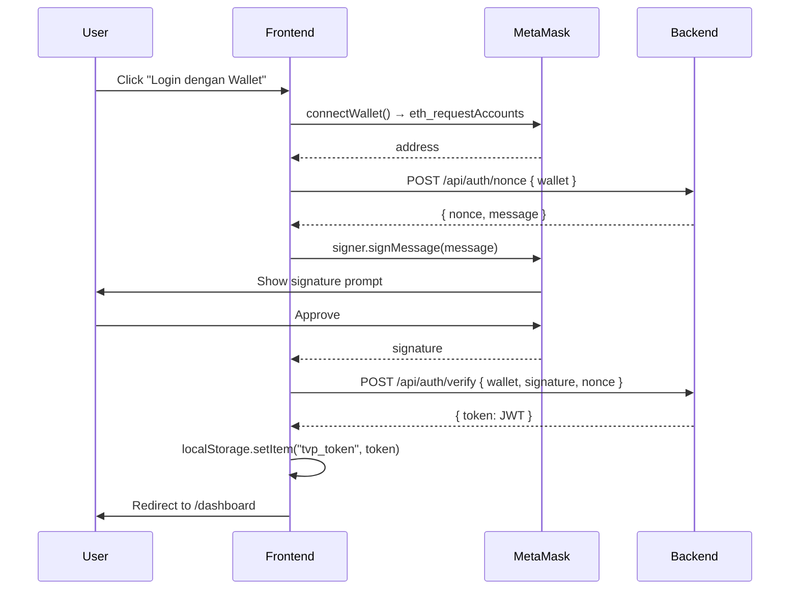
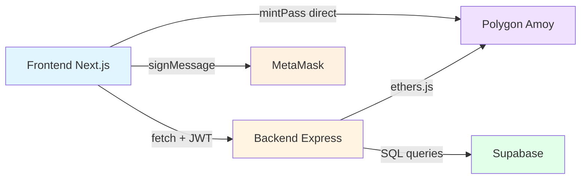

<div align="center">

# 🎨 Frontend — Module Specification

## *TravelVerse Pass · Next.js 14 Application*

**Next.js · TypeScript · ethers.js v6 · App Router**


> 📘 **Module:** Frontend · **Status:** Functional (NO STYLING — siap untuk tim styling)
> 🤝 **Handover:** Tim styling tinggal tambah Tailwind classes ke komponen yang sudah ada.

</div>

---

## 📑 Document Control

<table>
<tr>
<td><b>📄 Document</b></td>
<td>Frontend Module Specification</td>
<td><b>🏷️ Version</b></td>
<td><code>1.0.0-pre-style</code></td>
</tr>
<tr>
<td><b>📅 Date</b></td>
<td>2026-05-17</td>
<td><b>📊 Status</b></td>
<td><code>READY FOR STYLING</code></td>
</tr>
<tr>
<td><b>👤 Functional Owner</b></td>
<td>Hilmy Raihan Alkindy</td>
<td><b>🎨 Styling Team</b></td>
<td>Tim FE (Ahsanta · Andika · Bagus)</td>
</tr>
</table>

---

## 1. Status Saat Ini

✅ **YANG SUDAH JADI:**
- Struktur lengkap Next.js 14 (App Router) + TypeScript
- 9 pages dengan integrasi backend API lengkap
- Auth flow SIWE-style (wallet signature → JWT)
- Direct contract call untuk `mintPass`
- QR scanner (camera + manual input fallback)
- Real-time event display (level up, tx hashes, dll)
- Type-safe API calls dengan shared types

⏳ **YANG BELUM (TUGAS TIM STYLING):**
- **Tailwind classes** — semua komponen pakai plain HTML tanpa class
- **Color scheme, typography, spacing** — kosong total
- **Loading states** UI — sekarang masih plain text "Memuat..."
- **Error states** UI — sekarang masih plain `<p role="alert">`
- **Mobile responsiveness**
- **Animations** (level up, badge mint, dll)

---

## 2. Folder Structure

```
frontend/
├── app/                              # Next.js App Router
│   ├── layout.tsx                    # Root layout + AuthProvider
│   ├── page.tsx                      # Landing page
│   ├── globals.css                   # Tailwind directives + reset
│   ├── login/page.tsx                # Wallet login
│   ├── mint-pass/page.tsx            # Mint Tourist Pass (user tx)
│   ├── dashboard/page.tsx            # User profile + balance + level
│   ├── destinations/
│   │   ├── page.tsx                  # List destinasi
│   │   └── [id]/
│   │       ├── page.tsx              # Destinasi detail
│   │       └── qr/page.tsx           # QR display (untuk tablet di lokasi)
│   ├── scan/page.tsx                 # QR scanner + check-in
│   ├── badges/page.tsx               # NFT badge collection
│   └── timeline/page.tsx             # Journey timeline grouped by year
├── components/
│   ├── WalletConnect.tsx             # Connect/disconnect button
│   ├── AuthGuard.tsx                 # Wrap protected pages
│   ├── NFTBadgeCard.tsx              # Card per badge
│   ├── LevelProgress.tsx             # Progress bar level
│   └── QRScanner.tsx                 # Camera + manual scanner
├── contexts/
│   └── AuthContext.tsx               # Global wallet+JWT state
├── lib/
│   ├── api.ts                        # fetch wrapper + token storage
│   ├── auth.ts                       # SIWE-style login flow
│   ├── wallet.ts                     # MetaMask + network switching
│   ├── contracts.ts                  # ethers.js + mintPass
│   └── types.ts                      # Shared TypeScript types
├── public/
├── package.json
├── tsconfig.json
├── next.config.js
├── tailwind.config.ts                # Tailwind setup (siap dipakai)
├── postcss.config.js
└── .env.example
```

---

## 3. Pages Overview

| Path | Auth | Purpose | Key Integration |
|:---|:---:|:---|:---|
| `/` | ❌ | Landing page | — |
| `/login` | ❌ | Wallet connect + sign | POST /auth/nonce + /auth/verify |
| `/mint-pass` | 🔒 | Mint Tourist Pass | **Direct contract call** (user pay gas) |
| `/dashboard` | 🔒 | Profile + level + balance | GET /api/me |
| `/destinations` | ❌ | List destinasi | GET /api/destinations |
| `/destinations/:id` | ❌ | Detail destinasi | GET /api/destinations/:id |
| `/destinations/:id/qr` | ❌ | QR display (operator) | GET /api/destinations/:id/qr |
| `/scan` | 🔒 | Scan QR + check-in | POST /api/checkin |
| `/badges` | 🔒 | NFT collection | GET /api/me/badges |
| `/timeline` | 🔒 | Journey history | GET /api/me/timeline |

---

## 4. Auth Flow (FE Implementation)



**Code lokasi:** [frontend/lib/auth.ts](../frontend/lib/auth.ts), [frontend/contexts/AuthContext.tsx](../frontend/contexts/AuthContext.tsx)

---

## 5. Setup Instructions

### 5.1 Install Dependencies

```bash
cd frontend
npm install
```

### 5.2 Setup Env

```bash
cp .env.example .env.local
# Edit .env.local — isi NEXT_PUBLIC_TOURIST_PASS_ADDRESS dari deployments/amoy.json
```

### 5.3 Run Dev

```bash
npm run dev
# Server di http://localhost:3000
```

**Pre-requisite:** Backend harus running di http://localhost:4000 (lihat [docs/BACKEND.md](BACKEND.md))

---

## 6. Untuk Tim Styling

### 6.1 Tailwind Sudah Di-setup

`tailwind.config.ts` dan `postcss.config.js` siap pakai. Tinggal tambah class di JSX:

```tsx
// Sebelum (current):
<button type="button" onClick={handleLogin}>
  Connect Wallet
</button>

// Sesudah styling:
<button
  type="button"
  onClick={handleLogin}
  className="bg-blue-600 hover:bg-blue-700 text-white font-semibold px-6 py-3 rounded-lg shadow-lg transition-colors"
>
  Connect Wallet
</button>
```

### 6.2 Komponen yang Perlu Di-style

Priority order (dari yang paling impactful ke user):

| Priority | Component/Page | Catatan |
|:---:|:---|:---|
| 🔴 P1 | `app/page.tsx` (landing) | First impression |
| 🔴 P1 | `app/login/page.tsx` | Critical conversion |
| 🔴 P1 | `app/dashboard/page.tsx` | Most-viewed page |
| 🔴 P1 | `app/scan/page.tsx` | Core feature |
| 🟡 P2 | `components/NFTBadgeCard.tsx` | Grid badges |
| 🟡 P2 | `components/LevelProgress.tsx` | Progress bar |
| 🟡 P2 | `app/badges/page.tsx` | Grid layout |
| 🟡 P2 | `app/timeline/page.tsx` | Timeline visual |
| 🟢 P3 | `app/destinations/page.tsx` | Card grid |
| 🟢 P3 | `app/destinations/[id]/page.tsx` | Detail page |
| 🟢 P3 | `app/destinations/[id]/qr/page.tsx` | QR display (mostly tablet) |

### 6.3 Design Suggestions (Opsional)

- **Tema warna:** Biru + hijau (sesuai prompt di README) — atau bebas
- **Typography:** Sans-serif modern (Inter, Geist)
- **Layout:** Container max-w-7xl + padding responsive
- **Mobile-first:** Banyak pengguna scan QR pakai HP
- **Animation:** Framer Motion untuk transisi badge mint & level up

### 6.4 Component Library

Bisa pakai shadcn/ui (sesuai README) atau bebas pilih:
- shadcn/ui: `npx shadcn@latest init`
- Material UI
- Mantine
- Atau pure Tailwind

### 6.5 Tidak Boleh Diubah (Logic)

⚠️ Bagian INI jangan diubah saat styling, hanya tambah class:

- `useEffect` calls
- `fetch` calls di `lib/api.ts`
- State management di context
- Error handling logic
- Event listeners (`onScan`, `onChange`, `onSubmit`)

---

## 7. Integration Map



**Aturan:**
- FE memanggil backend untuk SEMUA read & orchestration (check-in)
- FE memanggil contract LANGSUNG hanya untuk `mintPass` (user transaction)
- FE TIDAK pernah memanggil contract write yang `onlyOwner` (itu dari backend)
- FE TIDAK pernah memegang `OWNER_PRIVATE_KEY`

---

## 8. Testing Manually

```bash
# Terminal 1: Backend
cd backend && npm run dev

# Terminal 2: Frontend
cd frontend && npm run dev

# Buka http://localhost:3000
# Test flow:
# 1. Connect wallet di /login
# 2. Mint pass di /mint-pass
# 3. Buka /destinations/1/qr di tab lain
# 4. Scan QR di /scan (manual input juga bisa)
# 5. Lihat result + tx hashes
# 6. Buka /dashboard untuk lihat level naik
```

---

## 🔗 See Also

| Dokumen | Untuk |
|:---|:---|
| [GETTING_STARTED.md](GETTING_STARTED.md) | 🚀 Setup full stack dari nol |
| [USER_FLOW.md](USER_FLOW.md) | 🛣️ Apa yang user lihat di tiap page (UX flow) |
| [BACKEND.md](BACKEND.md) | 🌐 API endpoints yang dikonsumsi FE |
| [SMART_CONTRACTS.md](SMART_CONTRACTS.md) | 📜 Contract yang di-call langsung dari FE (mintPass) |
| [SIMULATION_FLOW.md](SIMULATION_FLOW.md) | 🧪 API testing untuk verify FE integration |

---

<div align="center">

### 📜 *Document End*

**Frontend Module — Functional, Ready for Styling**

<sub>Diserahkan oleh: <b>Hilmy Raihan Alkindy</b> · Untuk: Tim Styling TravelVerse Pass</sub>

<sub>© 2026 TravelVerse Pass — Kelompok 8 · TI A · Universitas Brawijaya</sub>

</div>
