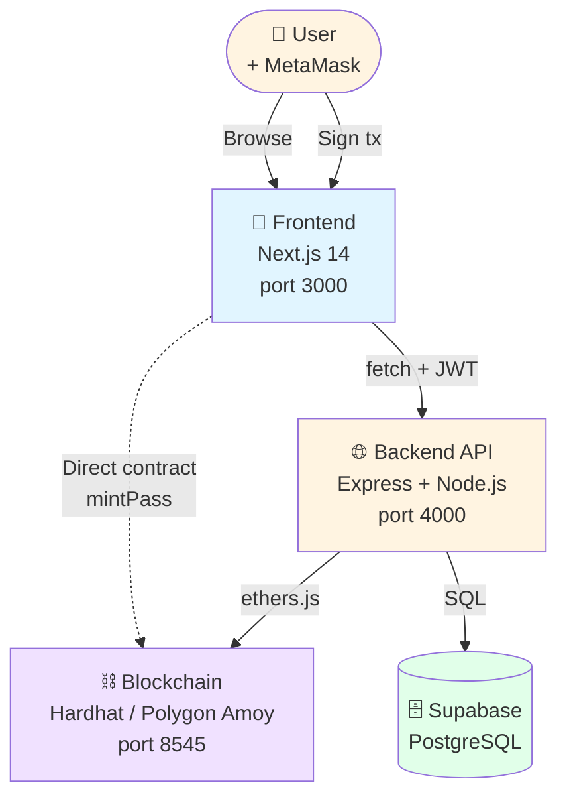

<div align="center">

# 🚀 Getting Started — Panduan Lengkap untuk Pemula

## *TravelVerse Pass · Setup & Run dari Nol*

**Tingkat Kesulitan:** 🟢 Beginner Friendly · **Estimasi Waktu:** ~45–60 menit


> 📘 Dokumen ini menjelaskan **setiap langkah dari cloning repo sampai aplikasi jalan end-to-end**.
> Gak perlu pengalaman blockchain sebelumnya — semua dijelaskan dari dasar.

</div>

---

## 📑 Document Control

<table>
<tr>
<td><b>📄 Document</b></td>
<td>Getting Started Guide</td>
<td><b>🏷️ Version</b></td>
<td><code>1.0.0</code></td>
</tr>
<tr>
<td><b>📅 Date</b></td>
<td>2026-05-18</td>
<td><b>👥 Audience</b></td>
<td>New developer, student, tester</td>
</tr>
<tr>
<td><b>🎯 Goal</b></td>
<td colspan="3">Setelah baca dokumen ini, kamu bisa jalanin full stack TravelVerse Pass di laptop sendiri.</td>
</tr>
</table>

---

## 📋 Table of Contents

<table>
<tr>
<td width="50%" valign="top">

**🟦 Section A — Konsep & Persiapan**
- [1. Apa Itu TravelVerse Pass?](#1-apa-itu-travelverse-pass)
- [2. Arsitektur Sistem](#2-arsitektur-sistem)
- [3. Prerequisites (Yang Harus Disiapkan)](#3-prerequisites-yang-harus-disiapkan)
- [4. Setup MetaMask Wallet](#4-setup-metamask-wallet)

**🟩 Section B — Installation**
- [5. Clone & Install Dependencies](#5-clone--install-dependencies)
- [6. Setup Hardhat (Local Blockchain)](#6-setup-hardhat-local-blockchain)
- [7. Deploy Smart Contracts](#7-deploy-smart-contracts)
- [8. Setup Supabase Database](#8-setup-supabase-database)

</td>
<td width="50%" valign="top">

**🟨 Section C — Run Application**
- [9. Configure Environment Variables](#9-configure-environment-variables)
- [10. Start Backend Server](#10-start-backend-server)
- [11. Start Frontend App](#11-start-frontend-app)
- [12. Connect MetaMask ke Aplikasi](#12-connect-metamask-ke-aplikasi)

**🟥 Section D — Demo Flow & Troubleshooting**
- [13. End-to-End Demo](#13-end-to-end-demo)
- [14. Common Errors & Fixes](#14-common-errors--fixes)
- [15. FAQ](#15-faq)

**📕 Annexes**
- [A. Hardhat Test Accounts](#annex-a--hardhat-test-accounts)
- [B. Useful Commands](#annex-b--useful-commands)
- [C. Glossary](#annex-c--glossary)

</td>
</tr>
</table>

---

## 1. Apa Itu TravelVerse Pass?

**TravelVerse Pass** adalah platform wisata berbasis blockchain dengan 3 komponen utama:

| 🪪 | **NFT Tourist Pass** | Identitas digital traveler (1 NFT per wallet) |
| :---: | :--- | :--- |
| 🏅 | **Destination Badge** | NFT collectible per destinasi (klaim dengan scan QR) |
| 🪙 | **Reward Token (TVT)** | Token loyalty (10 TVT per check-in, 200 TVT bonus level up) |

### 1.1 Use Case Sederhana

```
🧳 User datang ke Candi Borobudur
   ↓
📱 Scan QR code yang dipajang di lokasi
   ↓
✅ Sistem verifikasi QR + lokasi
   ↓
🎁 User dapat: 1 NFT Borobudur + 10 TVT
   ↓
🏆 Setelah 6 kunjungan beda destinasi: Level up Beginner → Explorer + 200 TVT bonus
```

### 1.2 Kenapa Blockchain?

| Tradisional | Blockchain |
|:---|:---|
| Tiket kertas bisa dipalsukan | NFT terverifikasi on-chain |
| Loyalty card hilang | Token TVT permanent di wallet |
| Vendor lock-in | Cross-platform interoperable |
| Tidak ada koleksi achievement | Badge NFT bisa di-share/diperjualbelikan |

---

## 2. Arsitektur Sistem



### 2.1 Komponen yang Akan Dijalankan

| # | Komponen | Bahasa | Port | Fungsi |
|:---:|:---|:---|:---:|:---|
| 1 | **Hardhat Node** | JavaScript | `8545` | Local Ethereum blockchain |
| 2 | **Smart Contracts** | Solidity | — | 3 contracts: TouristPass, DestinationBadge, RewardToken |
| 3 | **Backend API** | Node.js | `4000` | REST endpoints, orchestrate on-chain calls |
| 4 | **Frontend App** | TypeScript + Next.js | `3000` | UI yang dilihat user |
| 5 | **Supabase** | (cloud) | — | Database untuk destinasi & visit history |
| 6 | **MetaMask** | (browser ext) | — | Wallet user untuk sign transactions |

### 2.2 Total Terminal yang Dibutuhkan

```
┌─ Terminal 1: Hardhat Node    (npx hardhat node)
├─ Terminal 2: Smart Contract  (npm run deploy:local)
├─ Terminal 3: Backend         (npm run dev)
└─ Terminal 4: Frontend        (npm run dev)
```

---

## 3. Prerequisites (Yang Harus Disiapkan)

### 3.1 Software Wajib

| Software | Versi Minimum | Cara Install | Verify |
|:---|:---:|:---|:---|
| **Node.js** | `≥ 18.x` | https://nodejs.org/ | `node --version` |
| **npm** | `≥ 9.x` | Auto dengan Node.js | `npm --version` |
| **Git** | `≥ 2.x` | https://git-scm.com/ | `git --version` |
| **VS Code** (rekomendasi) | Latest | https://code.visualstudio.com/ | — |

### 3.2 Browser Extension

| Extension | Link | Fungsi |
|:---|:---|:---|
| **MetaMask** | https://metamask.io | Wallet untuk sign transactions |

### 3.3 Akun Online (Gratis)

| Service | Link | Fungsi |
|:---|:---|:---|
| **Supabase** | https://supabase.com | Database PostgreSQL gratis (free tier) |

### 3.4 Verify Setup

Jalankan command ini di terminal:

```bash
node --version    # harus: v18+
npm --version     # harus: 9+
git --version     # harus: 2+
```

✅ Kalau semua keluar versi (bukan error), lanjut ke step 4.

---

## 4. Setup MetaMask Wallet

### 4.1 Install Extension

1. Buka https://metamask.io
2. Klik **"Download"** → pilih browser kamu (Chrome/Firefox/Edge/Brave)
3. Install extension
4. **Buka extension** dari toolbar browser

### 4.2 Buat Wallet Baru ATAU Import

**Untuk pemula yang belum punya wallet:**
1. Klik **"Create a new wallet"**
2. Buat password (catat dengan aman!)
3. MetaMask kasih **Secret Recovery Phrase** (12 kata)
4. ⚠️ **CATAT & SIMPAN DI TEMPAT AMAN** — gak bisa pulih kalau hilang
5. Confirm seed phrase
6. Done

**Sudah punya wallet:**
1. Klik **"Import an existing wallet"**
2. Paste seed phrase
3. Buat password

### 4.3 Pin MetaMask Extension

Klik puzzle icon di toolbar browser → pin MetaMask → biar gampang diakses.

---

## 5. Clone & Install Dependencies

### 5.1 Clone Repository

```bash
cd ~/
git clone https://github.com/ChrozaGaming/TravelVersePass-Blockchain.git travelversepass-blockchain
cd travelversepass-blockchain
```

### 5.2 Install Dependencies di 3 Folder

Buka **3 terminal terpisah** (atau jalankan satu-satu):

**Terminal 1 — Root (smart contract):**
```bash
cd ~/travelversepass-blockchain
npm install
```

**Terminal 2 — Backend:**
```bash
cd ~/travelversepass-blockchain/backend
npm install
```

**Terminal 3 — Frontend:**
```bash
cd ~/travelversepass-blockchain/frontend
npm install
```

**Estimasi waktu:** 2–5 menit per folder, tergantung internet.

### 5.3 Verify Install

Cek ada folder `node_modules/` di 3 lokasi:

```bash
ls ~/travelversepass-blockchain/node_modules/ | head
ls ~/travelversepass-blockchain/backend/node_modules/ | head
ls ~/travelversepass-blockchain/frontend/node_modules/ | head
```

✅ Kalau ke-3 keluar list package, lanjut.

---

## 6. Setup Hardhat (Local Blockchain)

Hardhat = simulator blockchain yang jalan di laptop. **Gratis, instant, tanpa testnet token**.

### 6.1 Compile Smart Contracts

```bash
cd ~/travelversepass-blockchain
npm run compile
```

Output yang diharapkan:
```
Compiled 22 Solidity files successfully (evm target: cancun).
```

Ini menghasilkan ABI di folder `artifacts/` yang dibutuhkan backend & frontend.

### 6.2 Start Hardhat Node

**Buka terminal khusus untuk Hardhat (sebut Terminal 1):**

```bash
cd ~/travelversepass-blockchain
npx hardhat node
```

Output:
```
Started HTTP and WebSocket JSON-RPC server at http://127.0.0.1:8545/

Accounts
========
Account #0: 0xf39Fd6e51aad88F6F4ce6aB8827279cffFb92266 (10000 ETH)
Private Key: 0xac0974bec39a17e36ba4a6b4d238ff944bacb478cbed5efcae784d7bf4f2ff80

Account #1: 0x70997970C51812dc3A010C7d01b50e0d17dc79C8 (10000 ETH)
Private Key: 0x59c6995e998f97a5a0044966f0945389dc9e86dae88c7a8412f4603b6b78690d

... (20 accounts total)
```

⚠️ **PENTING:** Biarkan terminal ini tetap terbuka. Kalau ditutup, blockchain mati, semua state hilang.

---

## 7. Deploy Smart Contracts

**Buka Terminal 2 (terminal baru, jangan Terminal 1 yang lagi running hardhat):**

```bash
cd ~/travelversepass-blockchain
npm run deploy:local
```

Output:
```
[1/3] Deploying TouristPass...
      OK → 0x5FbDB2315678afecb367f032d93F642f64180aa3
[2/3] Deploying DestinationBadge...
      OK → 0xe7f1725E7734CE288F8367e1Bb143E90bb3F0512
[3/3] Deploying RewardToken...
      OK → 0x9fE46736679d2D9a65F0992F2272dE9f3c7fa6e0

Saved to: deployments/localhost.json
```

✅ **3 contract berhasil di-deploy**. Address-nya **deterministic** (selalu sama setiap fresh node).

> 💡 **Tip:** Kalau Terminal 1 (Hardhat node) di-restart, contract harus di-deploy ulang. Karena address-nya deterministic, gak perlu ubah `.env`.

---

## 8. Setup Supabase Database

Backend butuh database untuk simpan destinasi + visit history.

### 8.1 Buat Project Supabase

1. Buka https://supabase.com → **Sign up** (gratis, login Google bisa)
2. Klik **"+ New project"**
3. Isi:
   - **Name:** `travelverse-pass`
   - **Database password:** generate random (catat!)
   - **Region:** **Southeast Asia (Singapore)** (latency terdekat dari Indonesia)
4. Klik **Create new project** → tunggu ~2 menit sampai provisioning selesai

### 8.2 Ambil Credentials

1. Di project dashboard, klik **⚙️ Settings** (sidebar kiri)
2. Klik **API Keys**
3. Catat dua hal:
   - **Project URL:** `https://xxxxx.supabase.co`
   - **service_role key** (yang **secret**, bukan anon/publishable) — di section "service_role" atau "Secret keys"

### 8.3 Jalankan Schema SQL

1. Sidebar kiri → **SQL Editor**
2. Klik **+ New query**
3. Buka file [backend/db/schema.sql](../backend/db/schema.sql)
4. Copy isi → paste ke SQL Editor → klik **Run**

✅ Tabel `destinations` dan `visits` terbuat.

### 8.4 Seed Data Destinasi

1. SQL Editor → **+ New query**
2. Buka [backend/db/seed.sql](../backend/db/seed.sql)
3. Copy isi → paste → **Run**

✅ 8 destinasi wisata Indonesia ter-insert.

### 8.5 Verify Database

Sidebar **Table Editor** → klik tabel `destinations` → harusnya tampil 8 rows.

---

## 9. Configure Environment Variables

### 9.1 Root `.env` (Untuk Hardhat Deploy & Verify)

```bash
cd ~/travelversepass-blockchain
cp .env.example .env
```

Edit `.env`, isi:
```env
# Hardhat account #0 untuk testing local
PRIVATE_KEY=ac0974bec39a17e36ba4a6b4d238ff944bacb478cbed5efcae784d7bf4f2ff80

# Optional: Polygonscan API key untuk verify (skip kalau cuma local)
POLYGONSCAN_API_KEY=

# Address dari deployments/localhost.json
TOURIST_PASS_ADDRESS=0x5FbDB2315678afecb367f032d93F642f64180aa3
BADGE_ADDRESS=0xe7f1725E7734CE288F8367e1Bb143E90bb3F0512
TOKEN_ADDRESS=0x9fE46736679d2D9a65F0992F2272dE9f3c7fa6e0
```

### 9.2 Backend `.env`

```bash
cd backend
cp .env.example .env
```

Edit `backend/.env`:
```env
# Server
PORT=4000
NODE_ENV=development
CORS_ORIGIN=http://localhost:3000

# Blockchain — Hardhat Localhost
RPC_URL=http://127.0.0.1:8545
CHAIN_ID=31337

# Owner = Hardhat Account #0
OWNER_PRIVATE_KEY=0xac0974bec39a17e36ba4a6b4d238ff944bacb478cbed5efcae784d7bf4f2ff80

# Contract addresses (sama dengan root .env)
TOURIST_PASS_ADDRESS=0x5FbDB2315678afecb367f032d93F642f64180aa3
BADGE_ADDRESS=0xe7f1725E7734CE288F8367e1Bb143E90bb3F0512
TOKEN_ADDRESS=0x9fE46736679d2D9a65F0992F2272dE9f3c7fa6e0

# JWT — generate random hex string
JWT_SECRET=GANTI_DENGAN_RANDOM_HEX_32_BYTES
JWT_EXPIRES_IN=7d

# QR HMAC — generate random hex string
QR_SECRET=GANTI_DENGAN_RANDOM_HEX_32_BYTES
QR_TTL_SECONDS=900

# Supabase — paste dari Step 8.2
SUPABASE_URL=https://xxxxx.supabase.co
SUPABASE_SERVICE_ROLE_KEY=eyJhbGc...paste_service_role_key_here
```

**Generate random secret:**
```bash
openssl rand -hex 32
```
Jalankan 2x: untuk `JWT_SECRET` dan `QR_SECRET`.

### 9.3 Frontend `.env.local`

```bash
cd ../frontend
cp .env.example .env.local
```

Edit `frontend/.env.local`:
```env
# Backend API URL
NEXT_PUBLIC_API_URL=http://localhost:4000

# Blockchain — Hardhat Localhost
NEXT_PUBLIC_TOURIST_PASS_ADDRESS=0x5FbDB2315678afecb367f032d93F642f64180aa3
NEXT_PUBLIC_CHAIN_ID=31337
NEXT_PUBLIC_CHAIN_NAME=Hardhat Localhost
NEXT_PUBLIC_CHAIN_RPC=http://127.0.0.1:8545
NEXT_PUBLIC_BLOCK_EXPLORER=http://localhost:8545

# Supabase (anon key, optional kalau FE gak query DB langsung)
NEXT_PUBLIC_SUPABASE_URL=https://xxxxx.supabase.co
NEXT_PUBLIC_SUPABASE_ANON_KEY=eyJhbGc...anon_key_here
```

### 9.4 ⚠️ JANGAN COMMIT `.env`

Semua `.env` file sudah ada di `.gitignore`. **Pastikan gak pernah commit private key**.

---

## 10. Start Backend Server

**Buka Terminal 3 (terminal baru):**

```bash
cd ~/travelversepass-blockchain/backend
npm run dev
```

Output:
```
============================================================
  TravelVerse Pass — Backend API
============================================================
  Env:    development
  Port:   4000
  CORS:   http://localhost:3000
  Listen: http://localhost:4000
============================================================
```

### Verify Backend

Buka terminal baru lain, jalankan:
```bash
curl http://localhost:4000/health
```

Output:
```json
{"status":"ok","env":"development","timestamp":"..."}
```

✅ Backend ready.

---

## 11. Start Frontend App

**Buka Terminal 4:**

```bash
cd ~/travelversepass-blockchain/frontend
npm run dev
```

Output:
```
▲ Next.js 14.2.x
- Local:        http://localhost:3000
- Environments: .env.local

 ✓ Ready in 1.x s
```

### Verify Frontend

Buka browser → **http://localhost:3000**

✅ Kamu harus lihat landing page TravelVerse Pass dengan tombol "Connect Wallet".

---

## 12. Connect MetaMask ke Aplikasi

### 12.1 Add Hardhat Network ke MetaMask

1. Buka MetaMask extension
2. Klik dropdown network atas → **"+ Add network"**
3. Klik **"Add a network manually"**
4. Isi:

| Field | Value |
|:---|:---|
| Network name | `Hardhat Localhost` |
| RPC URL | `http://localhost:8545` |
| Chain ID | `31337` |
| Currency symbol | `ETH` |
| Block explorer URL | *(kosongin)* |

5. Klik **Save**

### 12.2 Import Hardhat Test Account

Hardhat node punya 20 akun pre-funded dengan 10000 ETH. Import salah satu untuk testing.

1. Klik avatar/profile MetaMask → **"+ Add account"** → **"Import account"**
2. Pilih type: **Private Key**
3. Paste private key Account #1:
   ```
   0x59c6995e998f97a5a0044966f0945389dc9e86dae88c7a8412f4603b6b78690d
   ```
4. Klik Import
5. Beri nama: "Hardhat Test #1"

✅ Akun baru muncul dengan address `0x70997970...79C8` dan balance **10000 ETH**.

⚠️ **JANGAN import Account #0** (`0xf39Fd6e51aad88F6F4ce6aB8827279cffFb92266`). Itu owner contract, dipakai backend. Konflik kalau juga dipakai MetaMask.

### 12.3 Switch ke Akun & Network yang Benar

Pastikan MetaMask:
- ✅ Network: **Hardhat Localhost**
- ✅ Account: **Hardhat Test #1** (yang baru di-import)
- ✅ Balance: **10000 ETH**

---

## 13. End-to-End Demo

Sekarang kamu siap test full flow!

### 13.1 Login dengan Wallet

1. Buka http://localhost:3000
2. Klik **"Login dengan Wallet"** (di hero section atau menu kanan atas)
3. MetaMask popup muncul — klik **Connect**
4. MetaMask popup kedua untuk sign message — klik **Sign**
5. ✅ Redirect ke `/dashboard`

### 13.2 Mint Tourist Pass

1. Di `/dashboard`, klik **"Mint Tourist Pass →"**
2. Form mint: input username (contoh: "Hilmy")
3. Klik **"Mint Pass"**
4. MetaMask popup — review tx → klik **Confirm**
5. Tunggu ~2 detik (di local instant)
6. ✅ Success page dengan Token ID #1
7. Redirect ke dashboard → tampil profile + level Beginner

### 13.3 Generate QR Code (untuk Demo)

Untuk simulate "QR di lokasi wisata":

1. Buka tab browser BARU → **http://localhost:3000/destinations/1/qr**
2. Tampil QR code untuk Candi Borobudur + countdown
3. Biarkan tab ini terbuka

### 13.4 Scan QR & Check-in

1. Tab pertama (asal) → ke **/scan**
2. Pilih mode **Manual** (kalau gak punya kamera atau testing cepat)
3. Buka tab QR dari step 13.3
4. Buka **"Debug info"** di bawah QR → copy field **Token** (format `1.<ts>.<ts>.<hash>`)
5. Paste ke field manual input → klik **Submit**
6. Tunggu ~2 detik
7. ✅ "Check-in Berhasil!" dengan:
   - Badge NFT #1 minted
   - +10 TVT reward
   - Tx hashes (badge, visit, reward)

### 13.5 Verify Hasil

Buka:
- `/dashboard` → balance TVT 10.0, visits 1
- `/badges` → koleksi NFT pertama
- `/timeline` → record kunjungan 2026

### 13.6 Demo Level Up

Ulangi check-in 5x lagi di destinasi berbeda (Bromo, Kuta, Toba, Raja Ampat, Toraja):

| Visit ke- | Total Visits | Level |
|:---:|:---:|:---|
| 1 | 1 | Beginner |
| 5 | 5 | Beginner |
| **6** | **6** | **Explorer 🎉 +200 TVT** |
| 21 | 21 | Adventurer (jauh banget) |
| 50 | 50 | Legendary Traveler |

⚠️ **Constraint:** 1 destinasi 1x per hari. Kalau mau test cepat, ganti destinasi tiap check-in.

---

## 14. Common Errors & Fixes

### 14.1 `EADDRINUSE: port 4000 already in use`

**Cause:** Backend sudah jalan di port 4000 (mungkin sisa session sebelumnya).

**Fix:**
```bash
lsof -ti:4000 | xargs kill -9
npm run dev
```

### 14.2 `could not decode result data (value="0x")`

**Cause:** Contract gak ada di address yang diharapkan (Hardhat di-restart, state wipe).

**Fix:** Re-deploy contracts.
```bash
cd ~/travelversepass-blockchain
npm run deploy:local
```

### 14.3 `nonce too low / nonce too high`

**Cause:** MetaMask cache nonce dari session lama. Atau backend mengalami concurrent tx (sudah di-fix dengan NonceManager + mutex).

**Fix:**
1. MetaMask → Settings → Advanced → **Clear activity tab data**
2. Atau: hapus network Hardhat Localhost, add ulang

### 14.4 `Failed to fetch`

**Cause:** Frontend gak bisa connect ke backend.

**Fix:**
- Pastikan backend running di port 4000
- Pastikan frontend `.env.local` punya `NEXT_PUBLIC_API_URL=http://localhost:4000`
- Pastikan port frontend = 3000 (CORS allow)

### 14.5 `Insufficient funds for gas`

**Cause:** Wallet kamu balance 0 ETH (lupa import test account, atau pakai network salah).

**Fix:**
- Switch MetaMask network ke **Hardhat Localhost**
- Switch akun ke **Hardhat Test #1**
- Balance harus 10000 ETH

### 14.6 `already minted`

**Cause:** Wallet ini sudah pernah mint Tourist Pass (1x per wallet).

**Fix:**
- Buka `/dashboard` untuk lihat pass yang udah ada
- Atau import akun MetaMask lain yang belum mint

### 14.7 `already claimed today`

**Cause:** Sudah check-in di destinasi ini hari ini (1x per hari per destinasi).

**Fix:**
- Coba destinasi lain (8 destinasi tersedia)
- Atau tunggu 24 jam

### 14.8 MetaMask Tidak Detect Hardhat

**Cause:** Hardhat node belum jalan.

**Fix:**
```bash
cd ~/travelversepass-blockchain
npx hardhat node
```

Biarkan terminal terbuka.

---

## 15. FAQ

### Q1: Kenapa pakai Hardhat Localhost, bukan testnet asli?

**A:** Testnet (Polygon Amoy) butuh test token MATIC yang sulit dapat karena faucet rate-limited. Hardhat local: gratis 10000 ETH per akun, instant tx, gampang debug. Cocok untuk development & demo.

### Q2: Bisa pindah ke Polygon Amoy testnet kapan saja?

**A:** Bisa. Ganti env:
- Root `.env`: `PRIVATE_KEY` = wallet testnet kamu
- `backend/.env`: `RPC_URL=https://rpc-amoy.polygon.technology/`, `CHAIN_ID=80002`
- `frontend/.env.local`: `NEXT_PUBLIC_CHAIN_ID=80002`, `NEXT_PUBLIC_CHAIN_NAME=Polygon Amoy`
- Deploy: `npm run deploy:amoy` (butuh ~2 MATIC testnet)
- Paste address baru ke 3 file `.env`

### Q3: Kalau Hardhat node di-restart, apakah harus deploy ulang?

**A:** Ya. Hardhat in-memory — restart = state hilang. Tapi address-nya **deterministic**, jadi:
1. Restart node: `npx hardhat node`
2. Redeploy: `npm run deploy:local`
3. Address-nya sama persis, `.env` gak perlu diubah
4. ⚠️ MetaMask perlu **Clear activity tab data** karena nonce-nya cached

### Q4: Bisa di-deploy ke production / mainnet?

**A:** Untuk MVP tugas akhir, **tidak disarankan** karena:
- Gas fee mainnet pakai uang sungguhan
- Smart contract belum di-audit security professional
- Owner key di backend = single point of failure (production butuh multi-sig)

Untuk production-ready, perlu:
- Audit smart contract
- Multi-sig wallet (Gnosis Safe) untuk owner
- Pausable contract (emergency stop)
- Upgradeable contract (proxy pattern)
- Production-grade infra (Redis untuk nonce, multiple workers, dll)

### Q5: Bisa demo tanpa MetaMask?

**A:** Untuk full flow user (login, mint), butuh MetaMask. Tapi untuk backend testing via API, bisa pakai script Node.js — lihat [docs/SIMULATION_FLOW.md](SIMULATION_FLOW.md).

### Q6: Apakah perlu Supabase, atau bisa pakai local DB?

**A:** Supabase paling gampang (free tier, no setup). Tapi bisa di-replace dengan PostgreSQL local — update `SUPABASE_URL` ke connection string PostgreSQL local. Atau hapus dependency Supabase total dan ganti dengan SQLite/JSON file (butuh refactor backend).

### Q7: Kenapa backend butuh `OWNER_PRIVATE_KEY`?

**A:** Smart contract pakai `onlyOwner` modifier untuk fungsi sensitive (mintBadge, incrementVisit, rewardCheckin). Hanya address yang deploy contract yang bisa panggil. Backend = owner, jadi backend bisa orchestrate flow check-in atas nama user.

### Q8: Address `0x5FbDB...` itu address apa?

**A:** Itu address contract `TouristPass` di Hardhat localhost (chain 31337). Karena deploy deterministic dari Account #0 dengan nonce 0, addressnya selalu sama. Di Polygon Amoy, address-nya akan beda.

### Q9: Bisa pakai port lain selain 3000/4000/8545?

**A:** Bisa, tapi harus update env semua file:
- Backend port → `PORT=` di `backend/.env` + `CORS_ORIGIN=` (kalau FE pindah juga)
- Frontend → `NEXT_PUBLIC_API_URL=`
- Hardhat node → custom port, plus update `RPC_URL` di backend

Untuk simplicity, biarin default.

### Q10: Kenapa MetaMask minta sign message bukan tx pas login?

**A:** Sign message = off-chain, gratis (no gas), cuma membuktikan ownership wallet. Sign tx = on-chain, butuh gas, ubah state blockchain. Login cukup pakai sign message (pattern SIWE — Sign-In with Ethereum).

---

## Annex A — Hardhat Test Accounts

Default 20 akun Hardhat, semua 10000 ETH:

| # | Address | Private Key |
|:---:|:---|:---|
| 0 | `0xf39Fd6e51aad88F6F4ce6aB8827279cffFb92266` | `0xac0974bec39a17e36ba4a6b4d238ff944bacb478cbed5efcae784d7bf4f2ff80` |
| 1 | `0x70997970C51812dc3A010C7d01b50e0d17dc79C8` | `0x59c6995e998f97a5a0044966f0945389dc9e86dae88c7a8412f4603b6b78690d` |
| 2 | `0x3C44CdDdB6a900fa2b585dd299e03d12FA4293BC` | `0x5de4111afa1a4b94908f83103eb1f1706367c2e68ca870fc3fb9a804cdab365a` |
| 3 | `0x90F79bf6EB2c4f870365E785982E1f101E93b906` | `0x7c852118294e51e653712a81e05800f419141751be58f605c371e15141b007a6` |

**Aturan main:**
- Account #0 → **backend owner** (jangan import ke MetaMask)
- Account #1 → user wallet utama untuk testing
- Account #2-19 → user lain (test multi-user scenario)

⚠️ Private keys ini **PUBLIC** (well-known Hardhat default). **Jangan pakai untuk wallet mainnet sungguhan**.

---

## Annex B — Useful Commands

### Cek Port Status
```bash
lsof -i:3000   # Frontend
lsof -i:4000   # Backend
lsof -i:8545   # Hardhat
```

### Kill Process di Port
```bash
lsof -ti:4000 | xargs kill -9
```

### Cek Hardhat Node Alive
```bash
curl -s -X POST -H "Content-Type: application/json" \
  --data '{"jsonrpc":"2.0","method":"eth_chainId","params":[],"id":1}' \
  http://localhost:8545
```
Expected: `{"jsonrpc":"2.0","id":1,"result":"0x7a69"}` (0x7a69 = 31337)

### Cek Balance Account
```bash
curl -s -X POST -H "Content-Type: application/json" \
  --data '{"jsonrpc":"2.0","method":"eth_getBalance","params":["0x70997970C51812dc3A010C7d01b50e0d17dc79C8","latest"],"id":1}' \
  http://localhost:8545
```

### Cek Contract Deployed
```bash
curl -s -X POST -H "Content-Type: application/json" \
  --data '{"jsonrpc":"2.0","method":"eth_getCode","params":["0x5FbDB2315678afecb367f032d93F642f64180aa3","latest"],"id":1}' \
  http://localhost:8545 | head -c 100
```
Kalau result-nya `"0x"` = contract tidak ada, perlu redeploy. Kalau panjang hex = contract ada.

### Generate JWT_SECRET / QR_SECRET
```bash
openssl rand -hex 32
```

### Restart Full Stack
```bash
# Kill semua terminal node process
pkill -f "node"

# Restart 4 terminal sesuai urutan
# T1: cd ~/travelversepass-blockchain && npx hardhat node
# T2: cd ~/travelversepass-blockchain && npm run deploy:local
# T3: cd ~/travelversepass-blockchain/backend && npm run dev
# T4: cd ~/travelversepass-blockchain/frontend && npm run dev
```

---

## Annex C — Glossary

| Term | Definisi |
|:---|:---|
| **ABI** | Application Binary Interface — JSON spec yang dibutuhkan FE untuk call contract |
| **Address** | Identitas wallet/contract (format `0x...` 42 chars) |
| **Cancun** | Versi EVM terbaru, support opcode mcopy (yang dipakai OpenZeppelin v5.4+) |
| **chainId** | ID unik per blockchain network. Hardhat=31337, Polygon Amoy=80002, Ethereum=1 |
| **ERC-20** | Standard token fungible di Ethereum (digunakan untuk RewardToken) |
| **ERC-721** | Standard NFT non-fungible di Ethereum (digunakan untuk Pass & Badge) |
| **ethers.js** | Library JS untuk interact dengan Ethereum blockchain |
| **Gas** | Biaya transaksi blockchain (dibayar dalam ETH/MATIC) |
| **Hardhat** | Framework Ethereum development, include local blockchain & deployment tools |
| **HMAC** | Hash-based Message Authentication Code — anti-tampering signature (untuk QR) |
| **JWT** | JSON Web Token — bearer token untuk auth session |
| **MetaMask** | Browser extension wallet, populer untuk Ethereum |
| **mint** | Proses pembuatan token/NFT baru (transfer dari "nothing" ke address) |
| **Nonce** | Counter incrementing per address, mencegah replay attack. Setiap tx pakai nonce unik. |
| **OpenZeppelin** | Library kontrak Solidity yang sudah di-audit (ERC-721, ERC-20, Ownable, dll) |
| **Polygon Amoy** | Testnet Polygon (chainId 80002), gratis MATIC dari faucet |
| **Private Key** | Kunci rahasia 64 hex chars, kontrol penuh atas wallet — JANGAN SHARE |
| **RPC** | Remote Procedure Call — endpoint untuk komunikasi dengan blockchain node |
| **service_role key** | Supabase admin key (bypass RLS), HANYA untuk backend |
| **SIWE** | Sign-In with Ethereum — auth pattern: user sign message, server verify |
| **Smart Contract** | Kode yang jalan on-chain, immutable setelah deploy |
| **Testnet** | Blockchain untuk testing, token tidak punya nilai sungguhan |
| **TTL** | Time-to-Live, durasi sebelum expired (QR 15 menit, JWT 7 hari) |
| **TVT** | TravelVerse Token (ERC-20 reward) |
| **Wallet** | Aplikasi penyimpan private key untuk interact blockchain |

---

## 🔗 See Also

| Dokumen | Untuk Siapa |
|:---|:---|
| [USER_FLOW.md](USER_FLOW.md) | Apa yang user lihat & lakukan step-by-step |
| [SMART_CONTRACTS.md](SMART_CONTRACTS.md) | Spec lengkap 3 smart contract |
| [BACKEND.md](BACKEND.md) | API endpoints + integration guide |
| [FRONTEND.md](FRONTEND.md) | Struktur Next.js + styling guide |
| [SIMULATION_FLOW.md](SIMULATION_FLOW.md) | Postman/cURL API testing |

---

<div align="center">

### 📜 *Document End*

**Getting Started — Ready to Run**

<sub>Kalau ada error yang gak tercantum di troubleshoot, cek issue tracker atau tanya tim 🙏</sub>

<sub>© 2026 TravelVerse Pass — Kelompok 8 · TI A · Universitas Brawijaya</sub>

</div>
