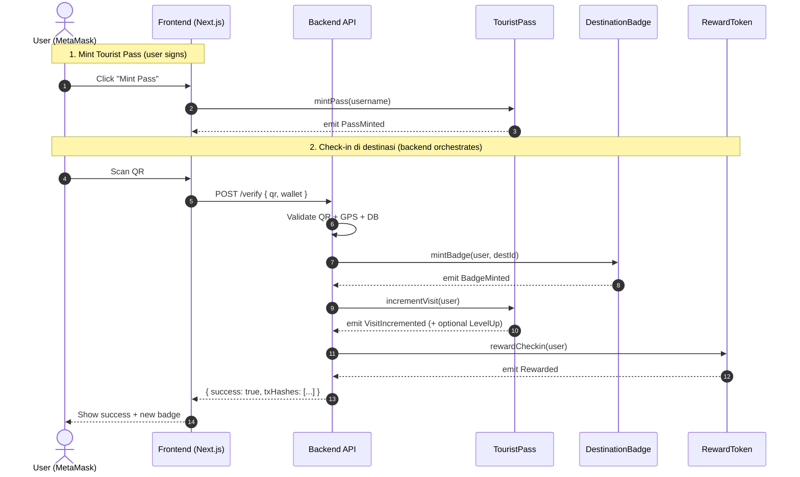

<div align="center">

# 📜 Smart Contracts — Module Specification

## *TravelVerse Pass · Blockchain Module Documentation*

**Solidity 0.8.20 · Hardhat · OpenZeppelin v5 · Polygon Amoy**


> 📘 **Module:** Smart Contracts · **Owner:** Hilmy Raihan Alkindy
> 🤝 **Handover:** Dokumen ini untuk tim Frontend & Backend yang akan integrasi.

</div>

---

## 📑 Document Control

<table>
  <tr>
    <td><b>📄 Document</b></td>
    <td>Smart Contracts Module Specification</td>
    <td><b>🏷️ Version</b></td>
    <td><code>1.0.0</code></td>
  </tr>
  <tr>
    <td><b>📅 Date</b></td>
    <td>2026-05-17</td>
    <td><b>📊 Status</b></td>
    <td><code>READY FOR HANDOVER</code></td>
  </tr>
  <tr>
    <td><b>👤 Module Owner</b></td>
    <td>Hilmy Raihan Alkindy</td>
    <td><b>🌐 Network</b></td>
    <td>Polygon Amoy (80002)</td>
  </tr>
  <tr>
    <td><b>🔖 Module Scope</b></td>
    <td colspan="3">3 Smart Contracts (ERC-721 × 2, ERC-20 × 1) + Deploy script + Unit tests</td>
  </tr>
</table>

---

## 📋 Table of Contents

<table>
<tr>
<td width="50%" valign="top">

**📘 Section A — Specification**
- [1. Module Scope](#1-module-scope)
- [2. Architecture Overview](#2-architecture-overview)
- [3. Contract Specifications](#3-contract-specifications)
- [4. Function Reference](#4-function-reference)
- [5. Events Catalog](#5-events-catalog)

</td>
<td width="50%" valign="top">

**📗 Section B — Integration & Ops**
- [6. Quick Start](#6-quick-start)
- [7. Frontend Integration Guide](#7-frontend-integration-guide)
- [8. Backend Orchestration Flow](#8-backend-orchestration-flow)
- [9. Security & Access Control](#9-security--access-control)
- [10. Testing](#10-testing)

**📕 Annexes**
- [A. Function Signatures](#annex-a--function-signatures)
- [B. Address Registry](#annex-b--address-registry)
- [C. Glossary](#annex-c--glossary)

</td>
</tr>
</table>

---

## 1. Module Scope

### 1.1 Tujuan

Module ini bertanggung jawab atas seluruh **on-chain state** TravelVerse Pass:
- Identitas wisata digital (ERC-721)
- Badge collectible per destinasi (ERC-721)
- Token loyalty TVT (ERC-20)

### 1.2 Boundary

<table>
<tr>
<th width="50%" align="center">✅ DI DALAM SCOPE</th>
<th width="50%" align="center">❌ DI LUAR SCOPE</th>
</tr>
<tr valign="top">
<td>

- 3 smart contracts (Solidity)
- Deploy script ke Polygon Amoy
- Unit tests (Hardhat + Chai)
- Event signatures untuk indexer
- View functions untuk read state

</td>
<td>

- Frontend UI (tim FE)
- QR generation & validation (tim Backend)
- GPS verification (tim Backend)
- IPFS metadata upload (tim Backend)
- User database (Supabase, tim Backend)

</td>
</tr>
</table>

### 1.3 Stakeholder Module

| Role | Tugas | Berinteraksi dengan |
|:---|:---|:---|
| **Smart Contract Dev** (Hilmy) | Develop, deploy, verify contract | Module ini |
| **Frontend Dev** | Call view functions, listen events, mint pass | Section 7 |
| **Backend Dev** | Orchestrate check-in flow, call onlyOwner functions | Section 8 |

---

## 2. Architecture Overview

### 2.1 Contract Map

<table>
<tr>
<th align="center">🆔</th>
<th align="left">Contract</th>
<th align="center">Standard</th>
<th align="left">Tanggung Jawab</th>
</tr>
<tr>
<td align="center"><code>SC-01</code></td>
<td><b>TouristPass.sol</b></td>
<td align="center">ERC-721</td>
<td>Identitas wisata digital. 1 NFT per wallet, simpan level & visit count.</td>
</tr>
<tr>
<td align="center"><code>SC-02</code></td>
<td><b>DestinationBadge.sol</b></td>
<td align="center">ERC-721</td>
<td>Badge collectible per destinasi. 1 claim per user per destinasi per hari.</td>
</tr>
<tr>
<td align="center"><code>SC-03</code></td>
<td><b>RewardToken.sol</b></td>
<td align="center">ERC-20</td>
<td>Token loyalty TVT. Reward 10 TVT per check-in, 200 TVT per level up.</td>
</tr>
</table>

### 2.2 Interaction Flow



### 2.3 Trust Model

| Aktor | Hak |
|:---|:---|
| **End User (wallet)** | Hanya boleh `mintPass()` di TouristPass — selebihnya read-only |
| **Backend Signer (owner)** | Bisa panggil `incrementVisit`, `mintBadge`, `reward*` |
| **Public** | Read semua view function & event log |

> ⚠️ **Backend signer = deployer wallet.** Backup private key & gunakan dedicated wallet untuk production. Untuk MVP demo, deployer wallet sudah cukup.

---

## 3. Contract Specifications

### 3.1 `TouristPass.sol` — ERC-721

**Purpose:** Identitas wisata digital. 1 NFT per wallet.

<details>
<summary>📦 <b>State Variables</b></summary>

| Variable | Type | Visibility | Description |
|:---|:---|:---:|:---|
| `passData[tokenId]` | `PassData` | public | Username, level, visitedCount, mintedAt |
| `walletToToken[addr]` | `uint256` | public | Lookup tokenId by wallet |
| `hasMinted[addr]` | `bool` | public | Apakah wallet sudah mint pass |

**Struct `PassData`:**
```solidity
struct PassData {
    string username;       // Display name (1-32 chars)
    string level;          // "Beginner" | "Explorer" | "Adventurer" | "Legendary Traveler"
    uint256 visitedCount;  // Jumlah destinasi yang sudah dikunjungi
    uint256 mintedAt;      // Unix timestamp saat pass di-mint
}
```

</details>

<details>
<summary>🔧 <b>External Functions</b></summary>

| Function | Access | Description |
|:---|:---:|:---|
| `mintPass(string username)` | 🌐 Public | User mint pass-nya sendiri. 1x per wallet. |
| `incrementVisit(address user)` | 🔒 onlyOwner | Tambah visit count + auto level up. |
| `getPassByWallet(address)` | 👁️ View | Ambil full PassData dari wallet. |
| `walletToToken(address)` | 👁️ View | Tokenid dari wallet (0 jika belum mint). |
| `hasMinted(address)` | 👁️ View | Cek apakah wallet sudah punya pass. |
| `totalSupply()` | 👁️ View | Total pass yang sudah di-mint. |

</details>

### 3.2 Sistem Level Traveler

| 🏆 | Level | Visited Count | Catatan |
|:---:|:---|:---:|:---|
| 🥉 | **Beginner** | `0 – 5` | Default saat mint |
| 🥈 | **Explorer** | `6 – 20` | +200 TVT bonus saat naik |
| 🥇 | **Adventurer** | `21 – 50` | +200 TVT bonus saat naik |
| 👑 | **Legendary Traveler** | `50+` | +200 TVT bonus saat naik |

> 💡 Level naik **otomatis on-chain** saat `incrementVisit` dipanggil. Event `LevelUp` di-emit hanya saat tier berubah.

---

### 3.3 `DestinationBadge.sol` — ERC-721

**Purpose:** Badge NFT collectible per destinasi. Anti-double-claim per hari.

<details>
<summary>📦 <b>State Variables</b></summary>

| Variable | Type | Visibility | Description |
|:---|:---|:---:|:---|
| `badgeData[tokenId]` | `BadgeData` | public | DestinationId & mintedAt |
| `lastClaimDay[user][destId]` | `uint256` | public | Hari terakhir user claim (block.timestamp / 1 days) |

**Struct `BadgeData`:**
```solidity
struct BadgeData {
    uint256 destinationId;  // ID destinasi (mapping ke off-chain DB)
    uint256 mintedAt;       // Unix timestamp
}
```

</details>

<details>
<summary>🔧 <b>External Functions</b></summary>

| Function | Access | Description |
|:---|:---:|:---|
| `mintBadge(address user, uint256 destId)` | 🔒 onlyOwner | Mint badge ke user untuk destinasi. |
| `getUserBadges(address)` | 👁️ View | Semua tokenId yang dimiliki user. |
| `getBadgesAtDestination(address, uint256)` | 👁️ View | TokenId user di destinasi tertentu. |
| `canClaimToday(address, uint256)` | 👁️ View | Cek apakah user bisa claim hari ini. |
| `totalSupply()` | 👁️ View | Total badge yang sudah di-mint. |

</details>

---

### 3.4 `RewardToken.sol` — ERC-20

**Purpose:** Token loyalty TVT.

<details>
<summary>📦 <b>Constants</b></summary>

| Constant | Value | Description |
|:---|:---:|:---|
| `CHECKIN_REWARD` | `10 * 10^18` | 10 TVT per check-in |
| `LEVEL_UP_BONUS` | `200 * 10^18` | 200 TVT bonus per level up |
| `INITIAL_SUPPLY` | `1_000_000 * 10^18` | 1 juta TVT di-mint ke contract |

</details>

<details>
<summary>🔧 <b>External Functions</b></summary>

| Function | Access | Description |
|:---|:---:|:---|
| `rewardCheckin(address user)` | 🔒 onlyOwner | Transfer 10 TVT ke user. |
| `rewardLevelUp(address user)` | 🔒 onlyOwner | Transfer 200 TVT bonus. |
| `rewardCustom(address, uint256, string)` | 🔒 onlyOwner | Reward custom amount + reason. |
| `balanceOf(address)` | 👁️ View | (Standard ERC-20) saldo wallet. |
| `transfer(address, uint256)` | 🌐 Public | (Standard ERC-20) user transfer. |

</details>

---

## 4. Function Reference

> 📌 Tabel master semua function. Gunakan untuk integrasi cepat.

<table>
<tr>
<th>Contract</th><th>Function</th><th>Caller</th><th>Returns</th><th>Reverts</th>
</tr>
<tr>
<td rowspan="3"><b>TouristPass</b></td>
<td><code>mintPass(username)</code></td>
<td>User</td>
<td>—</td>
<td>already minted, empty, too long</td>
</tr>
<tr>
<td><code>incrementVisit(user)</code></td>
<td>Owner</td>
<td>—</td>
<td>user has no pass</td>
</tr>
<tr>
<td><code>getPassByWallet(wallet)</code></td>
<td>Anyone</td>
<td><code>PassData</code></td>
<td>no pass for wallet</td>
</tr>
<tr>
<td rowspan="3"><b>DestinationBadge</b></td>
<td><code>mintBadge(user, destId)</code></td>
<td>Owner</td>
<td><code>uint256</code> tokenId</td>
<td>zero addr, already claimed today</td>
</tr>
<tr>
<td><code>getUserBadges(user)</code></td>
<td>Anyone</td>
<td><code>uint256[]</code></td>
<td>—</td>
</tr>
<tr>
<td><code>canClaimToday(user, destId)</code></td>
<td>Anyone</td>
<td><code>bool</code></td>
<td>—</td>
</tr>
<tr>
<td rowspan="3"><b>RewardToken</b></td>
<td><code>rewardCheckin(user)</code></td>
<td>Owner</td>
<td>—</td>
<td>zero addr, insufficient pool</td>
</tr>
<tr>
<td><code>rewardLevelUp(user)</code></td>
<td>Owner</td>
<td>—</td>
<td>zero addr, insufficient pool</td>
</tr>
<tr>
<td><code>rewardCustom(user, amount, reason)</code></td>
<td>Owner</td>
<td>—</td>
<td>zero addr, amount=0, insufficient pool</td>
</tr>
</table>

---

## 5. Events Catalog

> 🎯 Penting untuk **indexer backend** dan **realtime UI** di frontend.

| Contract | Event | Indexed Args | Use Case FE |
|:---|:---|:---|:---|
| `TouristPass` | `PassMinted(user, tokenId, username, ts)` | user, tokenId | Show toast "Pass minted!" |
| `TouristPass` | `VisitIncremented(user, tokenId, count)` | user, tokenId | Update visit counter di dashboard |
| `TouristPass` | `LevelUp(user, tokenId, old, new)` | user, tokenId | Show animasi level up |
| `DestinationBadge` | `BadgeMinted(user, destId, tokenId, ts)` | user, destId, tokenId | Show badge baru di collection |
| `RewardToken` | `Rewarded(user, amount, reason)` | user | Update saldo TVT + reason toast |
| `*` (standard ERC-721/20) | `Transfer(from, to, tokenId/value)` | from, to, tokenId | Standard wallet activity |

---

## 6. Quick Start

### 6.1 Prerequisites

| Tool | Version | Verify |
|:---|:---:|:---|
| Node.js | `≥ 18.x` | `node --version` |
| npm | `≥ 9.x` | `npm --version` |
| MetaMask | Latest | Browser extension |

### 6.2 Install

```bash
# Dari root project
npm install
```

### 6.3 Compile

```bash
npm run compile
# Output: artifacts/contracts/*.json (ABI di sini!)
```

### 6.4 Run Tests

```bash
# Run semua test
npm test

# Run dengan gas report
npm run test:gas

# Run dengan coverage
npm run coverage
```

### 6.5 Deploy ke Local (Hardhat Network)

```bash
# Terminal 1 — start local node
npm run node

# Terminal 2 — deploy
npm run deploy:local
```

### 6.6 Deploy ke Polygon Amoy Testnet

```bash
# Pastikan .env sudah diisi (PRIVATE_KEY)
# Pastikan wallet ada MATIC dari faucet:
# https://faucet.polygon.technology/

npm run deploy:amoy
```

Output akan tersimpan di [deployments/amoy.json](../deployments/amoy.json).

### 6.7 Verify di Polygonscan (Optional)

```bash
# Butuh POLYGONSCAN_API_KEY di .env
npx hardhat verify --network amoy <CONTRACT_ADDRESS>
```

---

## 7. Frontend Integration Guide

> 🎨 Untuk tim FE — copy-paste-ready snippets pakai **ethers.js v6**.

### 7.1 Setup ethers.js + ABI

```typescript
// frontend/lib/contracts.ts
import { ethers } from "ethers";
import TouristPassABI from "@/abi/TouristPass.json";
import DestinationBadgeABI from "@/abi/DestinationBadge.json";
import RewardTokenABI from "@/abi/RewardToken.json";

export const CONTRACTS = {
  touristPass: process.env.NEXT_PUBLIC_TOURIST_PASS_ADDRESS!,
  badge: process.env.NEXT_PUBLIC_BADGE_ADDRESS!,
  token: process.env.NEXT_PUBLIC_TOKEN_ADDRESS!,
};

export function getProvider() {
  if (typeof window === "undefined") return null;
  return new ethers.BrowserProvider((window as any).ethereum);
}

export async function getSigner() {
  const provider = getProvider();
  if (!provider) throw new Error("No wallet");
  return await provider.getSigner();
}

export async function getTouristPass(signerOrProvider: any) {
  return new ethers.Contract(
    CONTRACTS.touristPass,
    TouristPassABI,
    signerOrProvider
  );
}
```

> 📁 **ABI lokasi:** Setelah `npm run compile`, copy file dari `artifacts/contracts/<Name>.sol/<Name>.json` → ambil field `abi` saja → taruh di `frontend/abi/<Name>.json`.

### 7.2 Mint Tourist Pass (user signs)

```typescript
async function mintPass(username: string) {
  const signer = await getSigner();
  const contract = await getTouristPass(signer);

  const tx = await contract.mintPass(username);
  const receipt = await tx.wait();
  console.log("Pass minted! Tx:", receipt.hash);
  return receipt;
}
```

### 7.3 Read Pass Data

```typescript
async function getMyPass(walletAddress: string) {
  const provider = getProvider();
  const contract = await getTouristPass(provider);

  const hasMinted = await contract.hasMinted(walletAddress);
  if (!hasMinted) return null;

  const data = await contract.getPassByWallet(walletAddress);
  return {
    username: data.username,
    level: data.level,
    visitedCount: Number(data.visitedCount),
    mintedAt: new Date(Number(data.mintedAt) * 1000),
  };
}
```

### 7.4 Get Reward Token Balance

```typescript
async function getTokenBalance(walletAddress: string) {
  const provider = getProvider();
  const contract = new ethers.Contract(
    CONTRACTS.token,
    RewardTokenABI,
    provider
  );

  const balance = await contract.balanceOf(walletAddress);
  return ethers.formatEther(balance); // string, e.g. "30.0"
}
```

### 7.5 Get Badge Collection

```typescript
async function getUserBadges(walletAddress: string) {
  const provider = getProvider();
  const contract = new ethers.Contract(
    CONTRACTS.badge,
    DestinationBadgeABI,
    provider
  );

  const tokenIds = await contract.getUserBadges(walletAddress);

  const badges = await Promise.all(
    tokenIds.map(async (id: bigint) => {
      const data = await contract.badgeData(id);
      return {
        tokenId: Number(id),
        destinationId: Number(data.destinationId),
        mintedAt: new Date(Number(data.mintedAt) * 1000),
      };
    })
  );
  return badges;
}
```

### 7.6 Listen ke Real-time Events

```typescript
async function subscribeToBadgeMints(walletAddress: string, onMint: Function) {
  const provider = getProvider();
  const contract = new ethers.Contract(
    CONTRACTS.badge,
    DestinationBadgeABI,
    provider
  );

  // Filter: hanya event untuk user ini
  const filter = contract.filters.BadgeMinted(walletAddress);

  contract.on(filter, (user, destId, tokenId, timestamp) => {
    onMint({
      destinationId: Number(destId),
      tokenId: Number(tokenId),
      timestamp: new Date(Number(timestamp) * 1000),
    });
  });

  return () => contract.removeAllListeners(filter);
}
```

### 7.7 Network & Wallet Check

```typescript
const POLYGON_AMOY_CHAIN_ID = 80002;

async function ensureAmoyNetwork() {
  const provider = getProvider();
  if (!provider) throw new Error("No wallet");

  const network = await provider.getNetwork();
  if (Number(network.chainId) !== POLYGON_AMOY_CHAIN_ID) {
    await (window as any).ethereum.request({
      method: "wallet_switchEthereumChain",
      params: [{ chainId: "0x13882" }], // 80002 in hex
    });
  }
}
```

---

## 8. Backend Orchestration Flow

> 🔐 Backend memegang **owner private key** dan orchestrate semua onlyOwner calls.

### 8.1 Setup Server-Side Signer

```javascript
// backend/lib/signer.js
const { ethers } = require("ethers");

const provider = new ethers.JsonRpcProvider(
  process.env.AMOY_RPC_URL || "https://rpc-amoy.polygon.technology/"
);

const ownerSigner = new ethers.Wallet(
  process.env.OWNER_PRIVATE_KEY, // SAMA dengan deployer wallet
  provider
);

module.exports = { provider, ownerSigner };
```

### 8.2 Check-in Flow (atomic-ish)

```javascript
async function processCheckin(userWallet, destinationId) {
  // 1. Mint badge (revert if already claimed today)
  const badgeTx = await badge.mintBadge(userWallet, destinationId);
  const badgeReceipt = await badgeTx.wait();

  // 2. Increment visit (auto level up kalau perlu)
  const visitTx = await touristPass.incrementVisit(userWallet);
  const visitReceipt = await visitTx.wait();

  // 3. Reward 10 TVT
  const rewardTx = await token.rewardCheckin(userWallet);
  await rewardTx.wait();

  // 4. Cek event LevelUp di receipt — kalau ada, kasih bonus
  const levelUpLog = visitReceipt.logs.find((log) => {
    try {
      return touristPass.interface.parseLog(log)?.name === "LevelUp";
    } catch {
      return false;
    }
  });

  if (levelUpLog) {
    const bonusTx = await token.rewardLevelUp(userWallet);
    await bonusTx.wait();
  }

  return {
    badgeTxHash: badgeReceipt.hash,
    visitTxHash: visitReceipt.hash,
    levelUp: !!levelUpLog,
  };
}
```

> ⚠️ **Atomicity caveat:** Karena ini 3 transaksi terpisah, ada kemungkinan partial failure (badge mint sukses, reward gagal). Untuk MVP demo bisa di-handle dengan retry logic. Production butuh contract aggregator atau monitoring.

### 8.3 Error Mapping

| Revert Reason | HTTP Status | User-facing Message |
|:---|:---:|:---|
| `already minted` | `409` | "Kamu sudah punya Tourist Pass" |
| `already claimed today` | `429` | "Sudah claim hari ini di lokasi ini" |
| `user has no pass` | `400` | "Mint Tourist Pass dulu" |
| `insufficient pool` | `503` | "Pool reward habis, hubungi admin" |
| `OwnableUnauthorizedAccount` | `500` | "Server config error" |

---

## 9. Security & Access Control

### 9.1 Access Control Matrix

| Function | User | Owner | Public |
|:---|:---:|:---:|:---:|
| `TouristPass.mintPass` | ✅ | ✅ | — |
| `TouristPass.incrementVisit` | ❌ | ✅ | — |
| `DestinationBadge.mintBadge` | ❌ | ✅ | — |
| `RewardToken.reward*` | ❌ | ✅ | — |
| All view functions | ✅ | ✅ | ✅ |
| Standard ERC-20 `transfer` | ✅ (own) | ✅ | — |

### 9.2 Threat Mitigations

| Ancaman | Mitigasi |
|:---|:---|
| 🚫 Replay attack (claim QR berkali-kali) | `lastClaimDay` per user-destinasi, max 1x per hari |
| 🚫 User mint pass berkali-kali | `hasMinted` mapping, 1x per wallet selamanya |
| 🚫 Non-owner manipulate state | `Ownable` modifier `onlyOwner` |
| 🚫 Reward pool drained | `require balance >= amount` di `_payReward` |
| 🚫 Username injection (XSS via storage) | Max length 32, sanitize di FE saat render |

### 9.3 Known Limitations (MVP)

1. **Single owner key** — jika compromised, attacker bisa mint badge unlimited. Production: gunakan multi-sig (Gnosis Safe) atau role-based access (`AccessControl`).
2. **Tidak ada pause function** — jika ada bug, contract tidak bisa di-stop. Production: tambah `Pausable`.
3. **Hard-coded reward amounts** — `CHECKIN_REWARD` & `LEVEL_UP_BONUS` adalah constant. Production: jadikan setter `onlyOwner`.
4. **Atomic check-in tidak dijamin on-chain** — 3 tx terpisah. Production: bikin contract aggregator `CheckinHub.sol`.

> 🎓 Limitations ini OK untuk tugas akhir karena fokus akademik bukan production-readiness.

---

## 10. Testing

### 10.1 Test Coverage

| Contract | Test File | Test Cases |
|:---|:---|:---:|
| `TouristPass` | [test/TouristPass.test.js](../test/TouristPass.test.js) | 18 |
| `DestinationBadge` | [test/DestinationBadge.test.js](../test/DestinationBadge.test.js) | 13 |
| `RewardToken` | [test/RewardToken.test.js](../test/RewardToken.test.js) | 13 |

### 10.2 Running Tests

```bash
npm test                # Run all
npm run coverage        # With coverage report
npm run test:gas        # With gas report
```

### 10.3 Acceptance Criteria

| 🆔 | Criterion | Test |
|:---:|:---|:---|
| `AC-01` | User dapat mint TouristPass 1x | ✅ TouristPass: mintPass |
| `AC-02` | User TIDAK bisa mint 2x | ✅ TouristPass: reverts if already minted |
| `AC-03` | Level otomatis update di on-chain | ✅ TouristPass: levels up at 6/21/50 |
| `AC-04` | Badge tidak bisa di-claim 2x sehari | ✅ DestinationBadge: reverts on same-day claim |
| `AC-05` | User tidak bisa call onlyOwner | ✅ All: reverts with OwnableUnauthorizedAccount |
| `AC-06` | Reward token transfer 10 TVT per check-in | ✅ RewardToken: rewardCheckin |
| `AC-07` | Event di-emit dengan param yang benar | ✅ All: emit assertions |

---

## Annex A — Function Signatures

```solidity
// TouristPass
function mintPass(string calldata username) external;
function incrementVisit(address user) external; // onlyOwner
function getPassByWallet(address wallet) external view returns (PassData memory);
function walletToToken(address) external view returns (uint256);
function hasMinted(address) external view returns (bool);
function totalSupply() external view returns (uint256);

// DestinationBadge
function mintBadge(address user, uint256 destinationId) external returns (uint256); // onlyOwner
function getUserBadges(address user) external view returns (uint256[] memory);
function getBadgesAtDestination(address user, uint256 destId) external view returns (uint256[] memory);
function canClaimToday(address user, uint256 destId) external view returns (bool);
function totalSupply() external view returns (uint256);

// RewardToken
function rewardCheckin(address user) external; // onlyOwner
function rewardLevelUp(address user) external; // onlyOwner
function rewardCustom(address user, uint256 amount, string calldata reason) external; // onlyOwner
function balanceOf(address) external view returns (uint256); // standard ERC-20
function transfer(address to, uint256 amount) external returns (bool); // standard ERC-20
```

---

## Annex B — Address Registry

Setelah deploy, isi tabel ini & share ke tim FE:

| Network | Contract | Address | Polygonscan |
|:---|:---|:---|:---|
| Polygon Amoy | TouristPass | `0x...` | [link] |
| Polygon Amoy | DestinationBadge | `0x...` | [link] |
| Polygon Amoy | RewardToken | `0x...` | [link] |

> 📁 Address juga tersimpan otomatis di `deployments/amoy.json` setelah `npm run deploy:amoy`.

---

## Annex C — Glossary

| Term | Definition |
|:---|:---|
| **ABI** | Application Binary Interface — JSON spec yang dibutuhkan FE untuk call contract |
| **ERC-20** | Standard Ethereum untuk fungible token (RewardToken) |
| **ERC-721** | Standard Ethereum untuk NFT non-fungible (Pass & Badge) |
| **onlyOwner** | Modifier OpenZeppelin yang restrict function ke deployer/owner |
| **Owner** | Address yang punya privilege admin — set ke deployer saat constructor |
| **Polygon Amoy** | Testnet Polygon dengan chainId 80002 (gratis untuk demo) |
| **TVT** | Symbol token TravelVerse Token (loyalty reward) |
| **TVP** | Symbol NFT TravelVerse Pass (identitas) |
| **TVB** | Symbol NFT TravelVerse Badge (collectible) |

---

## 🔗 See Also

| Dokumen | Untuk |
|:---|:---|
| [GETTING_STARTED.md](GETTING_STARTED.md) | 🚀 Setup & run dari nol (4 terminal, MetaMask config) |
| [USER_FLOW.md](USER_FLOW.md) | 🛣️ End-to-end journey user di aplikasi |
| [BACKEND.md](BACKEND.md) | 🌐 REST API + integrasi backend |
| [FRONTEND.md](FRONTEND.md) | 🎨 Next.js app structure + styling guide |
| [SIMULATION_FLOW.md](SIMULATION_FLOW.md) | 🧪 Postman/cURL API testing |

---

<div align="center">

### 📜 *Document End*

**Smart Contracts Module — Ready for Handover**

<sub>Diserahkan oleh: <b>Hilmy Raihan Alkindy</b> · Untuk: Tim Frontend & Backend TravelVerse Pass</sub>

<sub>© 2026 TravelVerse Pass — Kelompok 8 · TI A · Universitas Brawijaya</sub>

</div>
