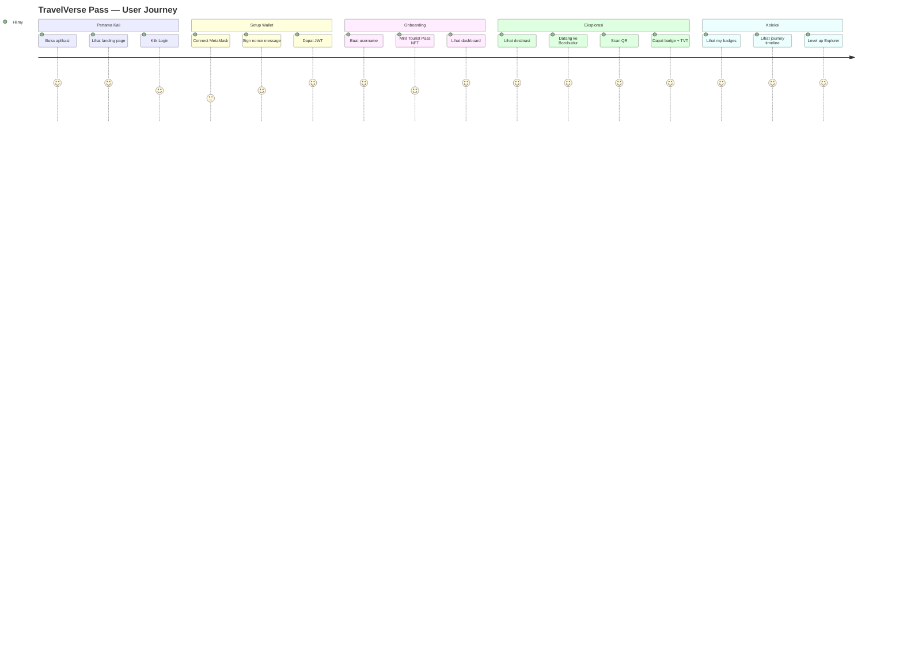
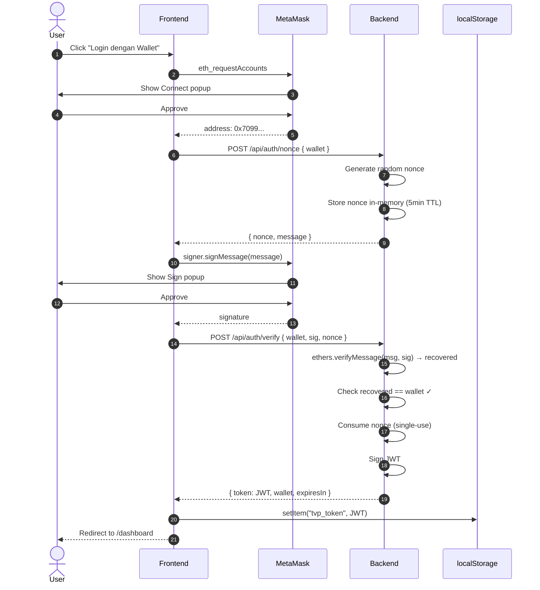
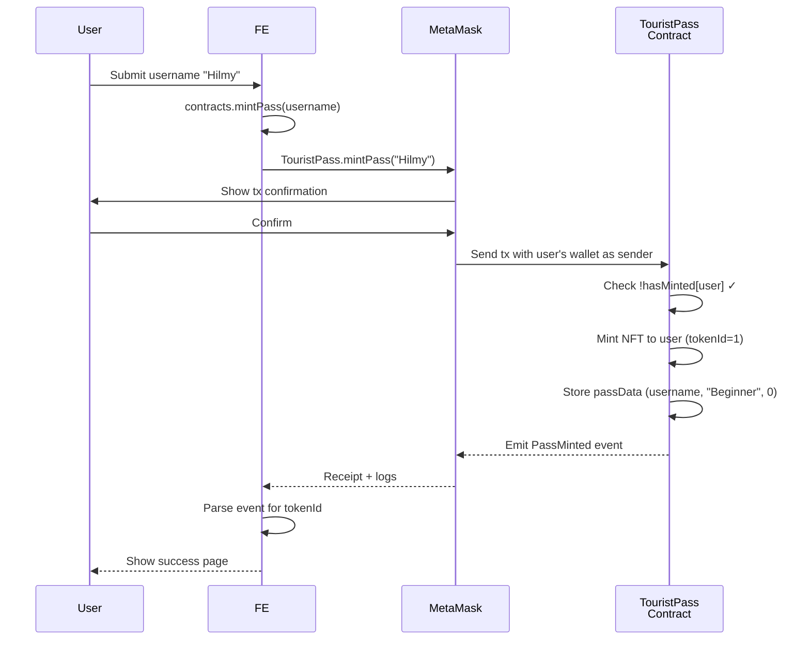
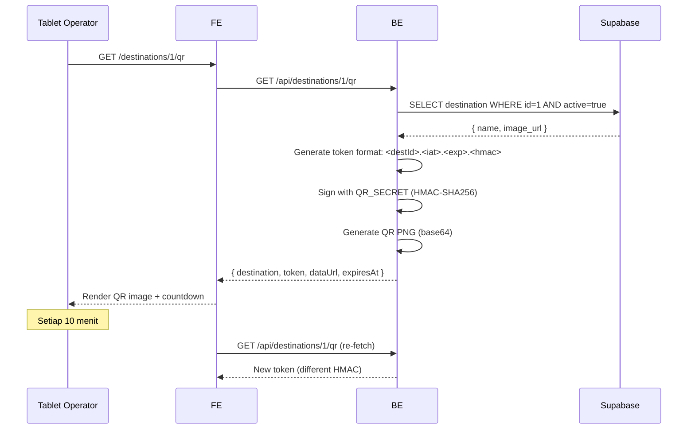
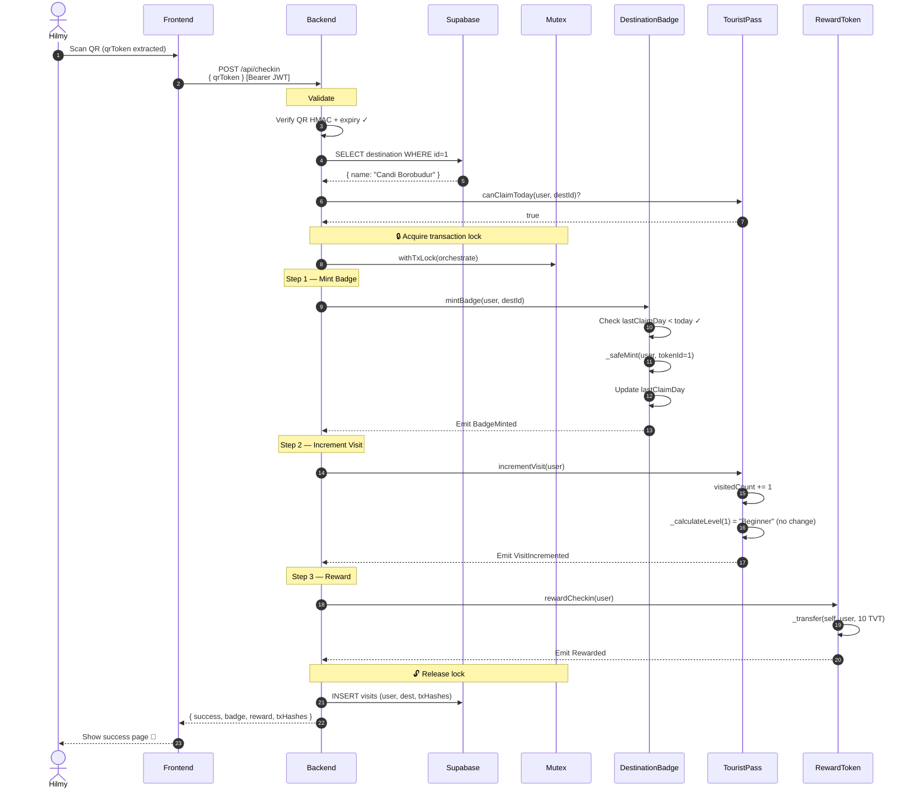
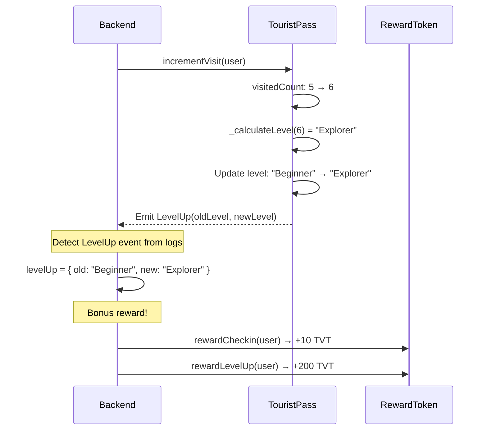

<div align="center">

# 🛣️ User Flow — End-to-End Journey

## *TravelVerse Pass · Apa yang User Lihat & Lakukan*

**Tingkat:** 🟢 Beginner Friendly · **Audience:** Tester, Demo Viewer, Dosen

> 📘 Dokumen ini menjelaskan **pengalaman pengguna lengkap** dari pertama buka aplikasi sampai dapat NFT badge + reward token TVT.

</div>

---

## 📑 Document Control

<table>
<tr>
<td><b>📄 Document</b></td>
<td>User Flow Documentation</td>
<td><b>🏷️ Version</b></td>
<td><code>1.0.0</code></td>
</tr>
<tr>
<td><b>📅 Date</b></td>
<td>2026-05-18</td>
<td><b>🎯 Scope</b></td>
<td>Frontend UX + Behind-the-scenes API/blockchain</td>
</tr>
</table>

---

## 📋 Table of Contents

<table>
<tr>
<td width="50%" valign="top">

**🟦 Section A — Big Picture**
- [1. Persona Pengguna](#1-persona-pengguna)
- [2. High-Level Journey Map](#2-high-level-journey-map)
- [3. System Roles](#3-system-roles)

**🟩 Section B — Flow Detail**
- [4. Flow #1: First-Time Visit (Landing)](#4-flow-1-first-time-visit-landing)
- [5. Flow #2: Login dengan Wallet](#5-flow-2-login-dengan-wallet)
- [6. Flow #3: Mint Tourist Pass](#6-flow-3-mint-tourist-pass)

</td>
<td width="50%" valign="top">

**🟨 Section C — Core Action**
- [7. Flow #4: Operator Pasang QR di Lokasi](#7-flow-4-operator-pasang-qr-di-lokasi)
- [8. Flow #5: Check-in Wisatawan](#8-flow-5-check-in-wisatawan)
- [9. Flow #6: Level Up Bonus](#9-flow-6-level-up-bonus)

**🟥 Section D — View & Manage**
- [10. Flow #7: Cek Dashboard & Balance](#10-flow-7-cek-dashboard--balance)
- [11. Flow #8: Lihat Badge Collection](#11-flow-8-lihat-badge-collection)
- [12. Flow #9: Journey Timeline](#12-flow-9-journey-timeline)
- [13. Flow #10: Logout](#13-flow-10-logout)

</td>
</tr>
</table>

---

## 1. Persona Pengguna

### 1.1 Primary Persona: Traveler

```
👤 NAMA      : Hilmy
🎂 USIA       : 20-an, mahasiswa
📱 SAVVY      : Familiar dengan smartphone & social media
💼 GOAL       : Koleksi NFT badge dari destinasi yang dia kunjungi
                + dapat reward token untuk diskon next trip
🚫 CONSTRAINT : Bukan crypto-expert. Pertama kali pakai MetaMask.
```

### 1.2 Secondary Persona: Operator Lokasi

```
👤 NAMA      : Bagus (staf wisata)
🎂 USIA       : 30-an, employee Borobudur
📱 SAVVY      : Familiar dengan tablet & POS system
💼 GOAL       : Display QR code rotating di papan info / tablet
                supaya wisatawan bisa scan
🚫 CONSTRAINT : Gak perlu install wallet, gak perlu login
```

---

## 2. High-Level Journey Map



---

## 3. System Roles

| Role | Who | What They Do |
|:---|:---|:---|
| 👤 **Traveler** | End user dengan MetaMask | Mint pass, scan QR, koleksi badge |
| 🏢 **Operator Lokasi** | Staf wisata di destinasi | Display QR code di tablet/papan |
| 🤖 **Backend (Owner)** | Server otomatis | Verify QR + orchestrate on-chain tx |
| ⛓️ **Smart Contracts** | Polygon/Hardhat | Store ownership of NFT + TVT |
| 🗄️ **Database** | Supabase | Master data destinasi + visit history |

---

## 4. Flow #1: First-Time Visit (Landing)

### 4.1 User Experience

```
👤 Hilmy buka https://travelverse-pass.com (atau localhost:3000)
   ↓
👁️ Lihat landing page:
   • Hero: "TravelVerse Pass — NFT Tourist Pass Platform"
   • 3 value props: Collectible · Verified · Gamified
   • 2 CTA: "Connect Wallet" dan "Login dengan Wallet"
   • 2 explore card: "Lihat Destinasi" dan "Scan QR"
   ↓
🤔 "Wah keren, gimana caranya dapet NFT badge?"
   ↓
👆 Klik "Login dengan Wallet"
```

### 4.2 What Happens Behind the Scenes

```
[Browser]
   GET / → load landing page (Next.js Server Component)
   ↓
[React Hydration]
   AuthContext useEffect → validateSession()
   ↓
[Backend API]
   GET /api/auth/me (kalau ada JWT di localStorage)
   ↓
[State]
   isLoggedIn = false → tampil tombol "Login"
```

**Files yang terlibat:**
- [frontend/app/page.tsx](../frontend/app/page.tsx) — Landing UI
- [frontend/contexts/AuthContext.tsx](../frontend/contexts/AuthContext.tsx) — Session check

---

## 5. Flow #2: Login dengan Wallet

### 5.1 Frontend User Experience

```
👤 Hilmy di /login
   ↓
👆 Klik "Login dengan Wallet"
   ↓
🦊 MetaMask popup #1 (Connect Request):
   "TravelVerse Pass wants to connect"
   Akun: 0x70997970...79C8
   [Cancel]  [Connect]
   ↓
👆 Klik Connect
   ↓
🦊 MetaMask popup #2 (Sign Message):
   "Welcome to TravelVerse Pass!
    Sign this message to login...
    Wallet: 0x70997970...
    Nonce: 0ab6fc4d..."
   [Reject]  [Sign]
   ↓
👆 Klik Sign
   ↓
⏳ Tombol berubah jadi "Menunggu signature..."
   ↓
✅ Redirect ke /dashboard
   📍 Header kanan atas: pill hijau "🟢 0x7099...79C8 ▼"
```

### 5.2 Backend + Blockchain Flow



### 5.3 Status Setelah Login

| Item | Value |
|:---|:---|
| **JWT** | Disimpan di `localStorage.tvp_token` |
| **AuthContext.wallet** | `0x70997970...79C8` |
| **AuthContext.isLoggedIn** | `true` |
| **Header UserMenu** | Tampil pill hijau dengan wallet pendek |

**Files:**
- [frontend/lib/auth.ts](../frontend/lib/auth.ts) — Login flow logic
- [backend/src/routes/auth.js](../backend/src/routes/auth.js) — Nonce + verify endpoints
- [backend/src/services/jwt.js](../backend/src/services/jwt.js) — JWT sign

---

## 6. Flow #3: Mint Tourist Pass

### 6.1 User Experience

```
👤 Hilmy di /dashboard (pertama kali)
   ↓
👁️ Lihat: "Kamu belum punya Tourist Pass"
   Tombol: "Mint Tourist Pass →"
   ↓
👆 Klik tombol
   ↓
📝 Halaman /mint-pass:
   • Form input username
   • Tombol "Mint Pass"
   ↓
✏️ Hilmy isi: "Hilmy"
   ↓
👆 Klik Mint Pass
   ↓
🦊 MetaMask popup tx confirmation:
   "Transaction details
    Function: mintPass
    Username: Hilmy
    Gas: ~0.001 ETH
    From: 0x70997970...
    To: 0x5FbDB231... (TouristPass contract)"
   [Reject]  [Confirm]
   ↓
👆 Klik Confirm
   ↓
⏳ Tombol "Minting..." selama ~2 detik (local) atau ~15 detik (testnet)
   ↓
🎉 Success page:
   "Tourist Pass berhasil di-mint!
    Token ID: #1
    Tx hash: 0xabc... (link ke explorer)"
   ↓
✅ Auto-redirect ke /dashboard setelah 3 detik
```

### 6.2 Behind the Scenes



⚠️ **Catatan:** Mint pass adalah **direct contract call** (bukan via backend). User bayar gas sendiri. Backend gak terlibat.

### 6.3 State Change

| Item | Before | After |
|:---|:---:|:---:|
| **NFT Pass count** | 0 | 1 |
| **Visit count** | — | 0 |
| **Level** | — | Beginner |
| **Username** | — | "Hilmy" |
| **`hasMinted[user]`** | false | true |

**Files:**
- [frontend/app/mint-pass/page.tsx](../frontend/app/mint-pass/page.tsx) — Form UI
- [frontend/lib/contracts.ts](../frontend/lib/contracts.ts) — `mintPass()` direct call
- [contracts/TouristPass.sol](../contracts/TouristPass.sol) — Smart contract logic

---

## 7. Flow #4: Operator Pasang QR di Lokasi

### 7.1 Operator Experience

```
👨‍💼 Bagus (staf Borobudur) buka tablet di pos masuk
   ↓
🌐 Browser → https://app.travelverse-pass.com/destinations/1/qr
   (atau localhost:3000/destinations/1/qr)
   ↓
👁️ Halaman tampil:
   • Judul: "Candi Borobudur"
   • QR code besar (400x400px)
   • Countdown: "Refresh dalam 14:32"
   ↓
🎯 Bagus letakkan tablet di papan info, biar wisatawan scan
   ↓
⏰ Tiap 10 menit, QR auto-refresh (TTL 15 menit, kasih buffer)
```

### 7.2 Behind the Scenes



### 7.3 QR Token Anatomy

```
1.1779037200.1779038100.abc123def456...
│ │          │          │
│ │          │          └─ HMAC-SHA256 signature
│ │          └─ Expires at (Unix timestamp + 900s)
│ └─ Issued at (Unix timestamp)
└─ Destination ID
```

**Anti-tampering:** Kalau ada yang ubah destId tanpa tahu QR_SECRET, HMAC gak match, server reject.

**Anti-replay:** QR expired setelah 15 menit. Foto QR lalu share gak akan jalan setelah 15 menit.

**Files:**
- [frontend/app/destinations/[id]/qr/page.tsx](../frontend/app/destinations/[id]/qr/page.tsx) — QR display
- [backend/src/routes/qr.js](../backend/src/routes/qr.js) — QR generation
- [backend/src/services/qr.js](../backend/src/services/qr.js) — HMAC logic

---

## 8. Flow #5: Check-in Wisatawan

### 8.1 Skenario Real-World

```
🚶 Hilmy datang ke Candi Borobudur
   ↓
📍 Liat tablet di pos masuk dengan QR code
   ↓
📱 Buka aplikasi TravelVerse Pass di HP
   ↓
👆 Tap "Scan QR" di menu
   ↓
📷 Kamera aktif, arahkan ke QR
   ↓
✅ Auto-detect → submit ke backend
   ↓
⏳ "Memproses transaksi on-chain..." (15-30 detik di testnet)
   ↓
🎉 Success page:
   "Check-in Berhasil!
    🏅 Badge NFT #1 — Candi Borobudur
    🪙 +10 TVT
    [Lihat di blockchain] [Scan Lagi] [Dashboard]"
```

### 8.2 Behind the Scenes — The Big One



### 8.3 What If Errors?

| Error | HTTP | Pesan ke User |
|:---|:---:|:---|
| QR tampered/expired | 400 | "QR tidak valid atau sudah expired. Scan QR terbaru di lokasi." |
| User belum mint pass | 400 | "Kamu belum punya Tourist Pass. Mint dulu." |
| Destinasi gak ada di DB | 404 | "Destinasi tidak ditemukan." |
| Sudah claim hari ini | 429 | "Sudah claim di destinasi ini hari ini. Coba lagi besok." |
| Backend bukan owner | 500 | "Server config error. Hubungi admin." |
| Reward pool habis | 503 | "Pool reward habis." |

### 8.4 State Change Setelah Check-in #1

| Item | Before | After |
|:---|:---:|:---:|
| **Badge NFT** | 0 | **1** (Token #1 — Borobudur) |
| **TVT Balance** | 0 | **10.0** |
| **Visit Count** | 0 | **1** |
| **Level** | Beginner | Beginner (≥6 untuk Explorer) |
| **DB visits row** | 0 | 1 |

**Files:**
- [frontend/app/scan/page.tsx](../frontend/app/scan/page.tsx) — Scanner UI + result
- [frontend/components/QRScanner.tsx](../frontend/components/QRScanner.tsx) — Camera + manual input
- [backend/src/routes/checkin.js](../backend/src/routes/checkin.js) — Orchestration endpoint
- [backend/src/services/blockchain.js](../backend/src/services/blockchain.js) — `processCheckin()` dengan mutex

---

## 9. Flow #6: Level Up Bonus

### 9.1 Threshold System

```
🥉 Beginner          : 0–5 visits
🥈 Explorer          : 6–20 visits     (+200 TVT saat naik)
🥇 Adventurer        : 21–50 visits    (+200 TVT saat naik)
👑 Legendary Traveler: 50+ visits       (+200 TVT saat naik)
```

### 9.2 Skenario: Visit ke-6 (Beginner → Explorer)

```
Hilmy sudah check-in di 5 destinasi:
   1. Borobudur ✓
   2. Bromo ✓
   3. Kuta ✓
   4. Toba ✓
   5. Raja Ampat ✓
   ↓
🎯 Sekarang scan QR di Tana Toraja (visit ke-6)
   ↓
⏳ Processing...
   ↓
🎉 Success page (extra section):
   "Check-in Berhasil!
    🏅 Badge NFT #6 — Tana Toraja
    🪙 +10 TVT (check-in)
    🌟 +200 TVT (LEVEL UP BONUS!)
    
    🆙 LEVEL UP!
       Beginner → Explorer 🎉"
```

### 9.3 Behind the Scenes



### 9.4 Total TVT Progression

| Visit | Total Visits | Reward | Cumulative TVT |
|:---:|:---:|:---|---:|
| 1 | 1 | +10 | 10 |
| 2 | 2 | +10 | 20 |
| 3 | 3 | +10 | 30 |
| 4 | 4 | +10 | 40 |
| 5 | 5 | +10 | 50 |
| **6** | **6** | +10 +200 (Explorer!) | **260** |
| 7-20 | 7-20 | +10 each | 260+140 = 400 |
| **21** | **21** | +10 +200 (Adventurer!) | **610** |
| 22-49 | 22-49 | +10 each | 610+280 = 890 |
| **50** | **50** | +10 +200 (Legendary!) | **1110** |

---

## 10. Flow #7: Cek Dashboard & Balance

### 10.1 User Experience

```
👤 Hilmy di /dashboard
   ↓
👁️ Lihat layout grid 3 kolom:
   
   ┌─────────────────────────┐
   │ 👤 Profil                │
   │ Username: Hilmy         │
   │ Wallet: 0x7099...79C8   │
   │ Member sejak: 18 Mei... │
   └─────────────────────────┘
   
   ┌─────────────────────────┐
   │ Level: 🥉 Beginner      │
   │ Visits: 5               │
   │ ▓▓▓▓▓░░░ 83%             │
   │ 1 kunjungan lagi untuk  │
   │ 🥈 Explorer             │
   └─────────────────────────┘
   
   ┌─────────────────────────┐
   │ 🪙 Reward Token          │
   │ 50.0                    │
   │ TVT                     │
   └─────────────────────────┘
   
   ┌─────────────────────────┐
   │ ⚡ Aksi Cepat            │
   │ [📷 Scan QR]            │
   │ [🗺️ Destinasi]          │
   │ [🏅 My Badges (5)]      │
   │ [📅 Timeline]           │
   └─────────────────────────┘
```

### 10.2 Behind the Scenes

```
[Frontend] /dashboard mount
   ↓
[AuthGuard] Cek JWT valid → render or redirect
   ↓
[fetch] GET /api/me [Bearer JWT]
   ↓
[Backend] Verify JWT, extract wallet
   ↓
[ethers.js] 
   ├── touristPass.hasMinted(wallet) → true
   ├── touristPass.getPassByWallet(wallet) → PassData
   └── rewardToken.balanceOf(wallet) → 50e18 wei
   ↓
[Response] {
  wallet,
  pass: { username, level, visitedCount, mintedAt },
  balance: "50.0"
}
   ↓
[Frontend] Render grid layout
```

**Files:**
- [frontend/app/dashboard/page.tsx](../frontend/app/dashboard/page.tsx) — Dashboard UI
- [frontend/components/LevelProgress.tsx](../frontend/components/LevelProgress.tsx) — Progress bar
- [backend/src/routes/me.js](../backend/src/routes/me.js) — `/api/me` endpoint

---

## 11. Flow #8: Lihat Badge Collection

### 11.1 User Experience

```
👤 Hilmy klik "🏅 My Badges (5)" di dashboard
   ↓
👁️ /badges page:
   "My Badges
    5 koleksi NFT dari destinasi yang sudah dikunjungi."
   
   Grid 3-kolom (responsive):
   ┌─────────┐ ┌─────────┐ ┌─────────┐
   │ [foto]  │ │ [foto]  │ │ [foto]  │
   │Borobudur│ │ Bromo   │ │ Kuta    │
   │  #1     │ │  #2     │ │  #3     │
   │18 Mei   │ │19 Mei   │ │20 Mei   │
   └─────────┘ └─────────┘ └─────────┘
   ┌─────────┐ ┌─────────┐
   │Toba #4  │ │R.Ampat#5│
   └─────────┘ └─────────┘
```

### 11.2 Behind the Scenes

```
[Frontend] /badges mount
   ↓
[fetch] GET /api/me/badges [Bearer JWT]
   ↓
[Backend]
   ├── badge.getUserBadges(wallet) → [1, 2, 3, 4, 5]
   ├── For each tokenId: badge.badgeData(id) → { destinationId, mintedAt }
   └── Supabase SELECT destinations WHERE id IN [1, 2, 3, 4, 5]
   ↓
[Enrich] Combine on-chain data + DB info (name, image_url)
   ↓
[Response] {
  badges: [{ tokenId, destination: {...}, mintedAt }, ...]
}
   ↓
[Frontend] Sort terbaru duluan, render grid
```

**Files:**
- [frontend/app/badges/page.tsx](../frontend/app/badges/page.tsx) — Grid UI
- [frontend/components/NFTBadgeCard.tsx](../frontend/components/NFTBadgeCard.tsx) — Per-card
- [backend/src/routes/me.js](../backend/src/routes/me.js) — `/api/me/badges`

---

## 12. Flow #9: Journey Timeline

### 12.1 User Experience

```
👤 Hilmy klik "📅 Timeline" di header atau dashboard
   ↓
👁️ /timeline page:
   "Journey Timeline
    Riwayat semua kunjungan kamu, dari yang terbaru."
   
   2026 ─────────────────────────────────
   │
   ● Tana Toraja (22 Mei 2026)
   │  Badge #6, 🌟 Level up: Explorer
   │  Lihat di Polygonscan →
   │
   ● Raja Ampat (21 Mei 2026)
   │  Badge #5
   │  Lihat di Polygonscan →
   │
   ● Danau Toba (20 Mei 2026)
   │  Badge #4
   │
   ... dst
```

### 12.2 Behind the Scenes

```
[Frontend] /timeline mount
   ↓
[fetch] GET /api/me/timeline [Bearer JWT]
   ↓
[Backend] Supabase query:
   SELECT visits.*, destinations.*
   FROM visits LEFT JOIN destinations
   WHERE user_wallet = ? ORDER BY visited_at DESC
   ↓
[Backend] Group by year (2026, 2025, dst)
   ↓
[Response] {
  timeline: {
    "2026": [{ id, destination, visitedAt, badgeTokenId, txHash, levelAfter }],
    "2025": [...]
  }
}
   ↓
[Frontend] Render vertical timeline dengan dots & line
```

**Catatan:** Timeline data dari **database**, bukan blockchain. DB lebih fast untuk query history. Blockchain hanya sebagai source-of-truth untuk ownership.

---

## 13. Flow #10: Logout

### 13.1 User Experience

```
👤 Hilmy klik pill wallet di header (pojok kanan atas)
   ↓
📋 Dropdown muncul:
   ┌────────────────────────────┐
   │ WALLET         [📋 Copy]    │
   │ 0x70997970...79C8           │
   │ 🟢 Hardhat Localhost        │
   ├────────────────────────────┤
   │ 📊 Dashboard                │
   │ 🏅 My Badges                │
   │ 📅 Timeline                 │
   ├────────────────────────────┤
   │ 🚪 Logout                   │
   └────────────────────────────┘
   ↓
👆 Klik Logout
   ↓
⚠️ Confirm dialog:
   "Yakin logout? Kamu akan login ulang dengan sign message MetaMask."
   [Cancel]  [OK]
   ↓
👆 Klik OK
   ↓
🧹 JWT dihapus dari localStorage
   ↓
🏠 Redirect ke /
   ↓
🦊 Header berubah: pill diganti tombol "🦊 Login"
```

### 13.2 Behind the Scenes

```
[UserMenu] Click logout
   ↓
[window.confirm()] User confirm
   ↓
[AuthContext] logout() called
   ├── clearToken() → localStorage.removeItem("tvp_token")
   └── setWallet(null) → isLoggedIn = false
   ↓
[Next router] replace("/") → navigate to home
   ↓
[Re-render] UserMenu shows "Login" button
```

**Catatan penting:**
- Logout **hanya hapus JWT dari client**. Backend tidak ada session storage, jadi JWT yang lama secara teknis masih valid sampai expired (7 hari).
- Untuk security ekstra, bisa implement **JWT blacklist** di Redis. Untuk MVP, gak perlu.
- **Wallet di MetaMask tidak terpengaruh** — masih tetap terkoneksi ke akun. User bisa langsung login lagi.

**Files:**
- [frontend/components/UserMenu.tsx](../frontend/components/UserMenu.tsx) — Dropdown + logout
- [frontend/contexts/AuthContext.tsx](../frontend/contexts/AuthContext.tsx) — State management
- [frontend/lib/auth.ts](../frontend/lib/auth.ts) — `logout()` function

---

## 🎯 Quick Reference: Page → API Mapping

| Page (FE) | API Call (BE) | Smart Contract |
|:---|:---|:---|
| `/` | — | — |
| `/login` | `/api/auth/nonce` + `/api/auth/verify` | — |
| `/mint-pass` | — | `TouristPass.mintPass(string)` |
| `/dashboard` | `/api/me` | `hasMinted`, `getPassByWallet`, `balanceOf` |
| `/destinations` | `/api/destinations` | — |
| `/destinations/:id` | `/api/destinations/:id` | — |
| `/destinations/:id/qr` | `/api/destinations/:id/qr` | — |
| `/scan` | `/api/checkin` | `mintBadge`, `incrementVisit`, `rewardCheckin`, `rewardLevelUp` |
| `/badges` | `/api/me/badges` | `getUserBadges`, `badgeData` |
| `/timeline` | `/api/me/timeline` | — (DB only) |

---

## 📊 Total State After Full Demo

Setelah user lakukan 6 check-in di 6 destinasi berbeda:

### On-chain
- ✅ 1 TouristPass NFT (Token #1, level Explorer)
- ✅ 6 DestinationBadge NFTs (Token #1-6, 6 destinasi)
- ✅ 260 TVT (6×10 check-in + 200 level up bonus)

### Off-chain (Database)
- ✅ 6 rows di `visits` table dengan tx hashes

### Frontend
- ✅ JWT di localStorage (7 hari TTL)
- ✅ MetaMask masih konek

---

## 🔗 See Also

| Dokumen | Untuk |
|:---|:---|
| [GETTING_STARTED.md](GETTING_STARTED.md) | Cara setup & run dari nol |
| [SIMULATION_FLOW.md](SIMULATION_FLOW.md) | API testing via Postman/cURL |
| [SMART_CONTRACTS.md](SMART_CONTRACTS.md) | Detail spec 3 smart contract |
| [BACKEND.md](BACKEND.md) | Backend API reference |
| [FRONTEND.md](FRONTEND.md) | Frontend struktur Next.js |

---

<div align="center">

### 📜 *Document End*

**User Flow — Ready to Demonstrate**

<sub>🎯 10 flows · 6 phases · From login to level up — semua dicover</sub>

<sub>© 2026 TravelVerse Pass — Kelompok 8 · TI A · Universitas Brawijaya</sub>

</div>
